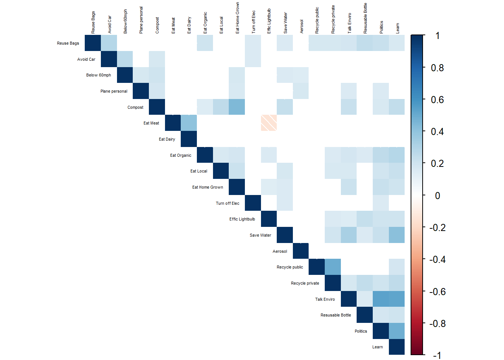
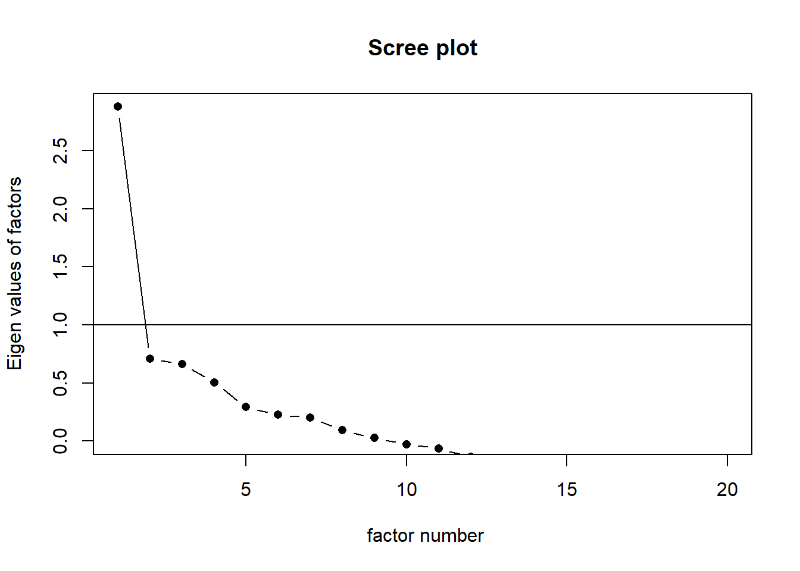
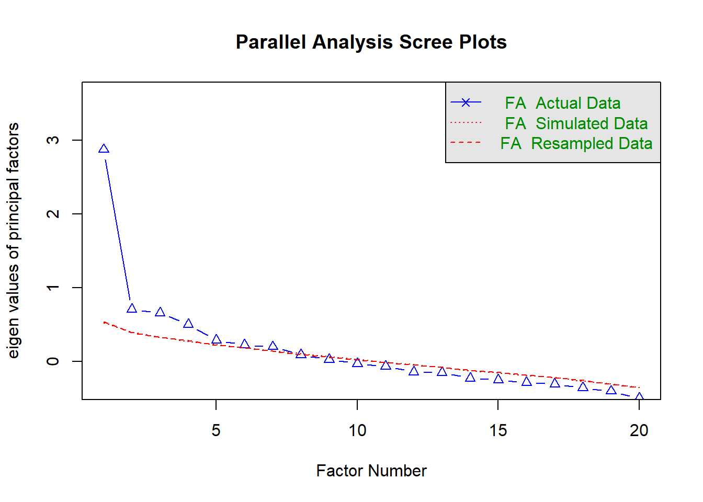
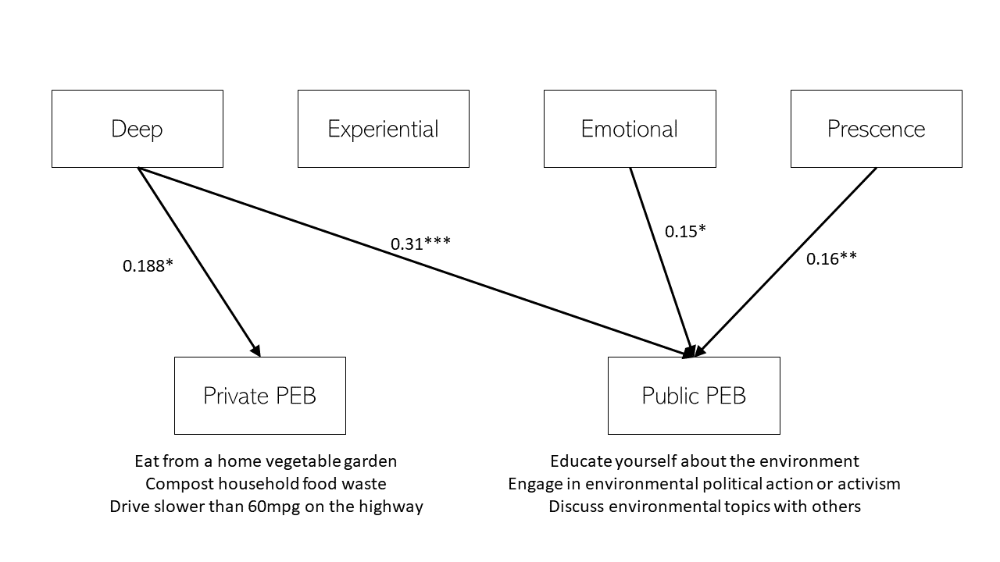

Data set - add the details of the datset here-

# Recurring PEB Scale (Brick et al., 2019)

## Correlation within items




## Cronbach's Alpha


```
## 
## Cronbach's alpha for the 'PEB' data-set
## 
## Items: 20
## Sample units: 341
## alpha: 0.704
```

## Exploratory Factor Analysis



```
## Warning in fa.stats(r = r, f = f, phi = phi, n.obs = n.obs, np.obs = np.obs, :
## The estimated weights for the factor scores are probably incorrect.  Try a
## different factor score estimation method.
```

```
## Warning in fac(r = r, nfactors = nfactors, n.obs = n.obs, rotate = rotate, : An
## ultra-Heywood case was detected.  Examine the results carefully
```



```
## Parallel analysis suggests that the number of factors =  7  and the number of components =  NA
```


Scree plot suggest ~2-4 factors
Parallel factor suggests 7 factors

## Two factor

```{=html}
<div class="tabwid"><style>.cl-963e97e4{table-layout:auto;width:100%;}.cl-96337a4e{font-family:'Times New Roman';font-size:10pt;font-weight:normal;font-style:normal;text-decoration:none;color:rgba(0, 0, 0, 1.00);background-color:transparent;}.cl-9638132e{margin:0;text-align:left;border-bottom: 0 solid rgba(0, 0, 0, 1.00);border-top: 0 solid rgba(0, 0, 0, 1.00);border-left: 0 solid rgba(0, 0, 0, 1.00);border-right: 0 solid rgba(0, 0, 0, 1.00);padding-bottom:5pt;padding-top:5pt;padding-left:5pt;padding-right:5pt;line-height: 1;background-color:transparent;}.cl-96381338{margin:0;text-align:right;border-bottom: 0 solid rgba(0, 0, 0, 1.00);border-top: 0 solid rgba(0, 0, 0, 1.00);border-left: 0 solid rgba(0, 0, 0, 1.00);border-right: 0 solid rgba(0, 0, 0, 1.00);padding-bottom:5pt;padding-top:5pt;padding-left:5pt;padding-right:5pt;line-height: 1;background-color:transparent;}.cl-963854c4{background-color:transparent;vertical-align: middle;border-bottom: 1.5pt solid rgba(102, 102, 102, 1.00);border-top: 1.5pt solid rgba(102, 102, 102, 1.00);border-left: 0 solid rgba(0, 0, 0, 1.00);border-right: 0 solid rgba(0, 0, 0, 1.00);margin-bottom:0;margin-top:0;margin-left:0;margin-right:0;}.cl-963854ce{background-color:transparent;vertical-align: middle;border-bottom: 1.5pt solid rgba(102, 102, 102, 1.00);border-top: 1.5pt solid rgba(102, 102, 102, 1.00);border-left: 0 solid rgba(0, 0, 0, 1.00);border-right: 0 solid rgba(0, 0, 0, 1.00);margin-bottom:0;margin-top:0;margin-left:0;margin-right:0;}.cl-963854d8{background-color:transparent;vertical-align: middle;border-bottom: 0 solid rgba(0, 0, 0, 1.00);border-top: 0 solid rgba(0, 0, 0, 1.00);border-left: 0 solid rgba(0, 0, 0, 1.00);border-right: 0 solid rgba(0, 0, 0, 1.00);margin-bottom:0;margin-top:0;margin-left:0;margin-right:0;}.cl-963854d9{background-color:transparent;vertical-align: middle;border-bottom: 0 solid rgba(0, 0, 0, 1.00);border-top: 0 solid rgba(0, 0, 0, 1.00);border-left: 0 solid rgba(0, 0, 0, 1.00);border-right: 0 solid rgba(0, 0, 0, 1.00);margin-bottom:0;margin-top:0;margin-left:0;margin-right:0;}.cl-963854da{background-color:transparent;vertical-align: middle;border-bottom: 1.5pt solid rgba(102, 102, 102, 1.00);border-top: 0 solid rgba(0, 0, 0, 1.00);border-left: 0 solid rgba(0, 0, 0, 1.00);border-right: 0 solid rgba(0, 0, 0, 1.00);margin-bottom:0;margin-top:0;margin-left:0;margin-right:0;}.cl-963854e2{background-color:transparent;vertical-align: middle;border-bottom: 1.5pt solid rgba(102, 102, 102, 1.00);border-top: 0 solid rgba(0, 0, 0, 1.00);border-left: 0 solid rgba(0, 0, 0, 1.00);border-right: 0 solid rgba(0, 0, 0, 1.00);margin-bottom:0;margin-top:0;margin-left:0;margin-right:0;}</style><table data-quarto-disable-processing='true' class='cl-963e97e4'>

```

<caption style="display:table-caption;margin:0pt;text-align:center;border-bottom: 0.00pt solid transparent;border-top: 0.00pt solid transparent;border-left: 0.00pt solid transparent;border-right: 0.00pt solid transparent;padding-top:3pt;padding-bottom:3pt;padding-left:3pt;padding-right:3pt;line-height: 1;background-color:transparent;">(\#tab:anytable)<span>Two Factor Structure</span></caption>

```{=html}

<thead><tr style="overflow-wrap:break-word;"><th class="cl-963854c4"><p class="cl-9638132e"><span class="cl-96337a4e">item</span></p></th><th class="cl-963854c4"><p class="cl-9638132e"><span class="cl-96337a4e">PA1</span></p></th><th class="cl-963854c4"><p class="cl-9638132e"><span class="cl-96337a4e">PA2</span></p></th><th class="cl-963854ce"><p class="cl-96381338"><span class="cl-96337a4e">Communality</span></p></th><th class="cl-963854ce"><p class="cl-96381338"><span class="cl-96337a4e">Uniqueness</span></p></th><th class="cl-963854ce"><p class="cl-96381338"><span class="cl-96337a4e">Complexity</span></p></th></tr></thead><tbody><tr style="overflow-wrap:break-word;"><td class="cl-963854d8"><p class="cl-9638132e"><span class="cl-96337a4e">Recycle private</span></p></td><td class="cl-963854d8"><p class="cl-9638132e"><span class="cl-96337a4e">0.88</span></p></td><td class="cl-963854d8"><p class="cl-9638132e"><span class="cl-96337a4e"></span></p></td><td class="cl-963854d9"><p class="cl-96381338"><span class="cl-96337a4e">3.841</span></p></td><td class="cl-963854d9"><p class="cl-96381338"><span class="cl-96337a4e">0.423</span></p></td><td class="cl-963854d9"><p class="cl-96381338"><span class="cl-96337a4e">1.464</span></p></td></tr><tr style="overflow-wrap:break-word;"><td class="cl-963854d8"><p class="cl-9638132e"><span class="cl-96337a4e">Recycle public</span></p></td><td class="cl-963854d8"><p class="cl-9638132e"><span class="cl-96337a4e">0.671</span></p></td><td class="cl-963854d8"><p class="cl-9638132e"><span class="cl-96337a4e"></span></p></td><td class="cl-963854d9"><p class="cl-96381338"><span class="cl-96337a4e">3.841</span></p></td><td class="cl-963854d9"><p class="cl-96381338"><span class="cl-96337a4e">0.663</span></p></td><td class="cl-963854d9"><p class="cl-96381338"><span class="cl-96337a4e">1.536</span></p></td></tr><tr style="overflow-wrap:break-word;"><td class="cl-963854d8"><p class="cl-9638132e"><span class="cl-96337a4e">Learn</span></p></td><td class="cl-963854d8"><p class="cl-9638132e"><span class="cl-96337a4e"></span></p></td><td class="cl-963854d8"><p class="cl-9638132e"><span class="cl-96337a4e"></span></p></td><td class="cl-963854d9"><p class="cl-96381338"><span class="cl-96337a4e">3.841</span></p></td><td class="cl-963854d9"><p class="cl-96381338"><span class="cl-96337a4e">0.543</span></p></td><td class="cl-963854d9"><p class="cl-96381338"><span class="cl-96337a4e">1.996</span></p></td></tr><tr style="overflow-wrap:break-word;"><td class="cl-963854d8"><p class="cl-9638132e"><span class="cl-96337a4e">Resusable Bottle</span></p></td><td class="cl-963854d8"><p class="cl-9638132e"><span class="cl-96337a4e"></span></p></td><td class="cl-963854d8"><p class="cl-9638132e"><span class="cl-96337a4e"></span></p></td><td class="cl-963854d9"><p class="cl-96381338"><span class="cl-96337a4e">3.841</span></p></td><td class="cl-963854d9"><p class="cl-96381338"><span class="cl-96337a4e">0.871</span></p></td><td class="cl-963854d9"><p class="cl-96381338"><span class="cl-96337a4e">1.000</span></p></td></tr><tr style="overflow-wrap:break-word;"><td class="cl-963854d8"><p class="cl-9638132e"><span class="cl-96337a4e">Reuse Bags</span></p></td><td class="cl-963854d8"><p class="cl-9638132e"><span class="cl-96337a4e"></span></p></td><td class="cl-963854d8"><p class="cl-9638132e"><span class="cl-96337a4e"></span></p></td><td class="cl-963854d9"><p class="cl-96381338"><span class="cl-96337a4e">3.841</span></p></td><td class="cl-963854d9"><p class="cl-96381338"><span class="cl-96337a4e">0.862</span></p></td><td class="cl-963854d9"><p class="cl-96381338"><span class="cl-96337a4e">1.025</span></p></td></tr><tr style="overflow-wrap:break-word;"><td class="cl-963854d8"><p class="cl-9638132e"><span class="cl-96337a4e">Save Water</span></p></td><td class="cl-963854d8"><p class="cl-9638132e"><span class="cl-96337a4e"></span></p></td><td class="cl-963854d8"><p class="cl-9638132e"><span class="cl-96337a4e"></span></p></td><td class="cl-963854d9"><p class="cl-96381338"><span class="cl-96337a4e">3.841</span></p></td><td class="cl-963854d9"><p class="cl-96381338"><span class="cl-96337a4e">0.788</span></p></td><td class="cl-963854d9"><p class="cl-96381338"><span class="cl-96337a4e">1.894</span></p></td></tr><tr style="overflow-wrap:break-word;"><td class="cl-963854d8"><p class="cl-9638132e"><span class="cl-96337a4e">Eat Local</span></p></td><td class="cl-963854d8"><p class="cl-9638132e"><span class="cl-96337a4e"></span></p></td><td class="cl-963854d8"><p class="cl-9638132e"><span class="cl-96337a4e"></span></p></td><td class="cl-963854d9"><p class="cl-96381338"><span class="cl-96337a4e">3.841</span></p></td><td class="cl-963854d9"><p class="cl-96381338"><span class="cl-96337a4e">0.872</span></p></td><td class="cl-963854d9"><p class="cl-96381338"><span class="cl-96337a4e">1.761</span></p></td></tr><tr style="overflow-wrap:break-word;"><td class="cl-963854d8"><p class="cl-9638132e"><span class="cl-96337a4e">Eat Organic</span></p></td><td class="cl-963854d8"><p class="cl-9638132e"><span class="cl-96337a4e"></span></p></td><td class="cl-963854d8"><p class="cl-9638132e"><span class="cl-96337a4e"></span></p></td><td class="cl-963854d9"><p class="cl-96381338"><span class="cl-96337a4e">3.841</span></p></td><td class="cl-963854d9"><p class="cl-96381338"><span class="cl-96337a4e">0.844</span></p></td><td class="cl-963854d9"><p class="cl-96381338"><span class="cl-96337a4e">1.961</span></p></td></tr><tr style="overflow-wrap:break-word;"><td class="cl-963854d8"><p class="cl-9638132e"><span class="cl-96337a4e">Effic Lightbulb</span></p></td><td class="cl-963854d8"><p class="cl-9638132e"><span class="cl-96337a4e"></span></p></td><td class="cl-963854d8"><p class="cl-9638132e"><span class="cl-96337a4e"></span></p></td><td class="cl-963854d9"><p class="cl-96381338"><span class="cl-96337a4e">3.841</span></p></td><td class="cl-963854d9"><p class="cl-96381338"><span class="cl-96337a4e">0.898</span></p></td><td class="cl-963854d9"><p class="cl-96381338"><span class="cl-96337a4e">1.737</span></p></td></tr><tr style="overflow-wrap:break-word;"><td class="cl-963854d8"><p class="cl-9638132e"><span class="cl-96337a4e">Avoid Car</span></p></td><td class="cl-963854d8"><p class="cl-9638132e"><span class="cl-96337a4e"></span></p></td><td class="cl-963854d8"><p class="cl-9638132e"><span class="cl-96337a4e"></span></p></td><td class="cl-963854d9"><p class="cl-96381338"><span class="cl-96337a4e">3.841</span></p></td><td class="cl-963854d9"><p class="cl-96381338"><span class="cl-96337a4e">0.942</span></p></td><td class="cl-963854d9"><p class="cl-96381338"><span class="cl-96337a4e">1.453</span></p></td></tr><tr style="overflow-wrap:break-word;"><td class="cl-963854d8"><p class="cl-9638132e"><span class="cl-96337a4e">Turn off Elec</span></p></td><td class="cl-963854d8"><p class="cl-9638132e"><span class="cl-96337a4e"></span></p></td><td class="cl-963854d8"><p class="cl-9638132e"><span class="cl-96337a4e"></span></p></td><td class="cl-963854d9"><p class="cl-96381338"><span class="cl-96337a4e">3.841</span></p></td><td class="cl-963854d9"><p class="cl-96381338"><span class="cl-96337a4e">0.950</span></p></td><td class="cl-963854d9"><p class="cl-96381338"><span class="cl-96337a4e">1.996</span></p></td></tr><tr style="overflow-wrap:break-word;"><td class="cl-963854d8"><p class="cl-9638132e"><span class="cl-96337a4e">Eat Home Grown</span></p></td><td class="cl-963854d8"><p class="cl-9638132e"><span class="cl-96337a4e"></span></p></td><td class="cl-963854d8"><p class="cl-9638132e"><span class="cl-96337a4e">0.469</span></p></td><td class="cl-963854d9"><p class="cl-96381338"><span class="cl-96337a4e">3.841</span></p></td><td class="cl-963854d9"><p class="cl-96381338"><span class="cl-96337a4e">0.776</span></p></td><td class="cl-963854d9"><p class="cl-96381338"><span class="cl-96337a4e">1.001</span></p></td></tr><tr style="overflow-wrap:break-word;"><td class="cl-963854d8"><p class="cl-9638132e"><span class="cl-96337a4e">Talk Enviro</span></p></td><td class="cl-963854d8"><p class="cl-9638132e"><span class="cl-96337a4e"></span></p></td><td class="cl-963854d8"><p class="cl-9638132e"><span class="cl-96337a4e">0.436</span></p></td><td class="cl-963854d9"><p class="cl-96381338"><span class="cl-96337a4e">3.841</span></p></td><td class="cl-963854d9"><p class="cl-96381338"><span class="cl-96337a4e">0.609</span></p></td><td class="cl-963854d9"><p class="cl-96381338"><span class="cl-96337a4e">1.703</span></p></td></tr><tr style="overflow-wrap:break-word;"><td class="cl-963854d8"><p class="cl-9638132e"><span class="cl-96337a4e">Compost</span></p></td><td class="cl-963854d8"><p class="cl-9638132e"><span class="cl-96337a4e"></span></p></td><td class="cl-963854d8"><p class="cl-9638132e"><span class="cl-96337a4e">0.414</span></p></td><td class="cl-963854d9"><p class="cl-96381338"><span class="cl-96337a4e">3.841</span></p></td><td class="cl-963854d9"><p class="cl-96381338"><span class="cl-96337a4e">0.772</span></p></td><td class="cl-963854d9"><p class="cl-96381338"><span class="cl-96337a4e">1.138</span></p></td></tr><tr style="overflow-wrap:break-word;"><td class="cl-963854d8"><p class="cl-9638132e"><span class="cl-96337a4e">Politics</span></p></td><td class="cl-963854d8"><p class="cl-9638132e"><span class="cl-96337a4e"></span></p></td><td class="cl-963854d8"><p class="cl-9638132e"><span class="cl-96337a4e"></span></p></td><td class="cl-963854d9"><p class="cl-96381338"><span class="cl-96337a4e">3.841</span></p></td><td class="cl-963854d9"><p class="cl-96381338"><span class="cl-96337a4e">0.608</span></p></td><td class="cl-963854d9"><p class="cl-96381338"><span class="cl-96337a4e">1.938</span></p></td></tr><tr style="overflow-wrap:break-word;"><td class="cl-963854d8"><p class="cl-9638132e"><span class="cl-96337a4e">Eat Meat</span></p></td><td class="cl-963854d8"><p class="cl-9638132e"><span class="cl-96337a4e"></span></p></td><td class="cl-963854d8"><p class="cl-9638132e"><span class="cl-96337a4e"></span></p></td><td class="cl-963854d9"><p class="cl-96381338"><span class="cl-96337a4e">3.841</span></p></td><td class="cl-963854d9"><p class="cl-96381338"><span class="cl-96337a4e">0.929</span></p></td><td class="cl-963854d9"><p class="cl-96381338"><span class="cl-96337a4e">1.392</span></p></td></tr><tr style="overflow-wrap:break-word;"><td class="cl-963854d8"><p class="cl-9638132e"><span class="cl-96337a4e">Eat Dairy</span></p></td><td class="cl-963854d8"><p class="cl-9638132e"><span class="cl-96337a4e"></span></p></td><td class="cl-963854d8"><p class="cl-9638132e"><span class="cl-96337a4e"></span></p></td><td class="cl-963854d9"><p class="cl-96381338"><span class="cl-96337a4e">3.841</span></p></td><td class="cl-963854d9"><p class="cl-96381338"><span class="cl-96337a4e">0.942</span></p></td><td class="cl-963854d9"><p class="cl-96381338"><span class="cl-96337a4e">1.457</span></p></td></tr><tr style="overflow-wrap:break-word;"><td class="cl-963854d8"><p class="cl-9638132e"><span class="cl-96337a4e">Below 60mph</span></p></td><td class="cl-963854d8"><p class="cl-9638132e"><span class="cl-96337a4e"></span></p></td><td class="cl-963854d8"><p class="cl-9638132e"><span class="cl-96337a4e"></span></p></td><td class="cl-963854d9"><p class="cl-96381338"><span class="cl-96337a4e">3.841</span></p></td><td class="cl-963854d9"><p class="cl-96381338"><span class="cl-96337a4e">0.931</span></p></td><td class="cl-963854d9"><p class="cl-96381338"><span class="cl-96337a4e">1.155</span></p></td></tr><tr style="overflow-wrap:break-word;"><td class="cl-963854d8"><p class="cl-9638132e"><span class="cl-96337a4e">Plane personal</span></p></td><td class="cl-963854d8"><p class="cl-9638132e"><span class="cl-96337a4e"></span></p></td><td class="cl-963854d8"><p class="cl-9638132e"><span class="cl-96337a4e"></span></p></td><td class="cl-963854d9"><p class="cl-96381338"><span class="cl-96337a4e">3.841</span></p></td><td class="cl-963854d9"><p class="cl-96381338"><span class="cl-96337a4e">0.945</span></p></td><td class="cl-963854d9"><p class="cl-96381338"><span class="cl-96337a4e">1.065</span></p></td></tr><tr style="overflow-wrap:break-word;"><td class="cl-963854da"><p class="cl-9638132e"><span class="cl-96337a4e">Aerosol</span></p></td><td class="cl-963854da"><p class="cl-9638132e"><span class="cl-96337a4e"></span></p></td><td class="cl-963854da"><p class="cl-9638132e"><span class="cl-96337a4e"></span></p></td><td class="cl-963854e2"><p class="cl-96381338"><span class="cl-96337a4e">3.841</span></p></td><td class="cl-963854e2"><p class="cl-96381338"><span class="cl-96337a4e">0.990</span></p></td><td class="cl-963854e2"><p class="cl-96381338"><span class="cl-96337a4e">1.002</span></p></td></tr></tbody></table></div>
```

```{=html}
<div class="tabwid"><style>.cl-9651326e{table-layout:auto;width:100%;}.cl-9646d9fe{font-family:'Times New Roman';font-size:10pt;font-weight:normal;font-style:normal;text-decoration:none;color:rgba(0, 0, 0, 1.00);background-color:transparent;}.cl-964a0eee{margin:0;text-align:left;border-bottom: 0 solid rgba(0, 0, 0, 1.00);border-top: 0 solid rgba(0, 0, 0, 1.00);border-left: 0 solid rgba(0, 0, 0, 1.00);border-right: 0 solid rgba(0, 0, 0, 1.00);padding-bottom:5pt;padding-top:5pt;padding-left:5pt;padding-right:5pt;line-height: 1;background-color:transparent;}.cl-964a0f02{margin:0;text-align:right;border-bottom: 0 solid rgba(0, 0, 0, 1.00);border-top: 0 solid rgba(0, 0, 0, 1.00);border-left: 0 solid rgba(0, 0, 0, 1.00);border-right: 0 solid rgba(0, 0, 0, 1.00);padding-bottom:5pt;padding-top:5pt;padding-left:5pt;padding-right:5pt;line-height: 1;background-color:transparent;}.cl-964a221c{background-color:transparent;vertical-align: middle;border-bottom: 1.5pt solid rgba(102, 102, 102, 1.00);border-top: 1.5pt solid rgba(102, 102, 102, 1.00);border-left: 0 solid rgba(0, 0, 0, 1.00);border-right: 0 solid rgba(0, 0, 0, 1.00);margin-bottom:0;margin-top:0;margin-left:0;margin-right:0;}.cl-964a221d{background-color:transparent;vertical-align: middle;border-bottom: 1.5pt solid rgba(102, 102, 102, 1.00);border-top: 1.5pt solid rgba(102, 102, 102, 1.00);border-left: 0 solid rgba(0, 0, 0, 1.00);border-right: 0 solid rgba(0, 0, 0, 1.00);margin-bottom:0;margin-top:0;margin-left:0;margin-right:0;}.cl-964a2226{background-color:transparent;vertical-align: middle;border-bottom: 0 solid rgba(0, 0, 0, 1.00);border-top: 0 solid rgba(0, 0, 0, 1.00);border-left: 0 solid rgba(0, 0, 0, 1.00);border-right: 0 solid rgba(0, 0, 0, 1.00);margin-bottom:0;margin-top:0;margin-left:0;margin-right:0;}.cl-964a2227{background-color:transparent;vertical-align: middle;border-bottom: 0 solid rgba(0, 0, 0, 1.00);border-top: 0 solid rgba(0, 0, 0, 1.00);border-left: 0 solid rgba(0, 0, 0, 1.00);border-right: 0 solid rgba(0, 0, 0, 1.00);margin-bottom:0;margin-top:0;margin-left:0;margin-right:0;}.cl-964a2230{background-color:transparent;vertical-align: middle;border-bottom: 1.5pt solid rgba(102, 102, 102, 1.00);border-top: 0 solid rgba(0, 0, 0, 1.00);border-left: 0 solid rgba(0, 0, 0, 1.00);border-right: 0 solid rgba(0, 0, 0, 1.00);margin-bottom:0;margin-top:0;margin-left:0;margin-right:0;}.cl-964a2231{background-color:transparent;vertical-align: middle;border-bottom: 1.5pt solid rgba(102, 102, 102, 1.00);border-top: 0 solid rgba(0, 0, 0, 1.00);border-left: 0 solid rgba(0, 0, 0, 1.00);border-right: 0 solid rgba(0, 0, 0, 1.00);margin-bottom:0;margin-top:0;margin-left:0;margin-right:0;}</style><table data-quarto-disable-processing='true' class='cl-9651326e'>

```

<caption style="display:table-caption;margin:0pt;text-align:center;border-bottom: 0.00pt solid transparent;border-top: 0.00pt solid transparent;border-left: 0.00pt solid transparent;border-right: 0.00pt solid transparent;padding-top:3pt;padding-bottom:3pt;padding-left:3pt;padding-right:3pt;line-height: 1;background-color:transparent;">(\#tab:anytable)<span>Eigenvalues and Variance Explained for Rotated Factor Solution</span></caption>

```{=html}

<thead><tr style="overflow-wrap:break-word;"><th class="cl-964a221c"><p class="cl-964a0eee"><span class="cl-9646d9fe">Property</span></p></th><th class="cl-964a221d"><p class="cl-964a0f02"><span class="cl-9646d9fe">PA1</span></p></th><th class="cl-964a221d"><p class="cl-964a0f02"><span class="cl-9646d9fe">PA2</span></p></th></tr></thead><tbody><tr style="overflow-wrap:break-word;"><td class="cl-964a2226"><p class="cl-964a0eee"><span class="cl-9646d9fe">SS loadings</span></p></td><td class="cl-964a2227"><p class="cl-964a0f02"><span class="cl-9646d9fe">2.184</span></p></td><td class="cl-964a2227"><p class="cl-964a0f02"><span class="cl-9646d9fe">1.657</span></p></td></tr><tr style="overflow-wrap:break-word;"><td class="cl-964a2226"><p class="cl-964a0eee"><span class="cl-9646d9fe">Proportion Var</span></p></td><td class="cl-964a2227"><p class="cl-964a0f02"><span class="cl-9646d9fe">0.109</span></p></td><td class="cl-964a2227"><p class="cl-964a0f02"><span class="cl-9646d9fe">0.083</span></p></td></tr><tr style="overflow-wrap:break-word;"><td class="cl-964a2226"><p class="cl-964a0eee"><span class="cl-9646d9fe">Cumulative Var</span></p></td><td class="cl-964a2227"><p class="cl-964a0f02"><span class="cl-9646d9fe">0.109</span></p></td><td class="cl-964a2227"><p class="cl-964a0f02"><span class="cl-9646d9fe">0.192</span></p></td></tr><tr style="overflow-wrap:break-word;"><td class="cl-964a2226"><p class="cl-964a0eee"><span class="cl-9646d9fe">Proportion Explained</span></p></td><td class="cl-964a2227"><p class="cl-964a0f02"><span class="cl-9646d9fe">0.569</span></p></td><td class="cl-964a2227"><p class="cl-964a0f02"><span class="cl-9646d9fe">0.431</span></p></td></tr><tr style="overflow-wrap:break-word;"><td class="cl-964a2230"><p class="cl-964a0eee"><span class="cl-9646d9fe">Cumulative Proportion</span></p></td><td class="cl-964a2231"><p class="cl-964a0f02"><span class="cl-9646d9fe">0.569</span></p></td><td class="cl-964a2231"><p class="cl-964a0f02"><span class="cl-9646d9fe">1.000</span></p></td></tr></tbody></table></div>
```


## Three factor

```{=html}
<div class="tabwid"><style>.cl-96765026{table-layout:auto;width:100%;}.cl-966a08b6{font-family:'Times New Roman';font-size:10pt;font-weight:normal;font-style:normal;text-decoration:none;color:rgba(0, 0, 0, 1.00);background-color:transparent;}.cl-966e4d7c{margin:0;text-align:left;border-bottom: 0 solid rgba(0, 0, 0, 1.00);border-top: 0 solid rgba(0, 0, 0, 1.00);border-left: 0 solid rgba(0, 0, 0, 1.00);border-right: 0 solid rgba(0, 0, 0, 1.00);padding-bottom:5pt;padding-top:5pt;padding-left:5pt;padding-right:5pt;line-height: 1;background-color:transparent;}.cl-966e4d90{margin:0;text-align:right;border-bottom: 0 solid rgba(0, 0, 0, 1.00);border-top: 0 solid rgba(0, 0, 0, 1.00);border-left: 0 solid rgba(0, 0, 0, 1.00);border-right: 0 solid rgba(0, 0, 0, 1.00);padding-bottom:5pt;padding-top:5pt;padding-left:5pt;padding-right:5pt;line-height: 1;background-color:transparent;}.cl-966e632a{background-color:transparent;vertical-align: middle;border-bottom: 1.5pt solid rgba(102, 102, 102, 1.00);border-top: 1.5pt solid rgba(102, 102, 102, 1.00);border-left: 0 solid rgba(0, 0, 0, 1.00);border-right: 0 solid rgba(0, 0, 0, 1.00);margin-bottom:0;margin-top:0;margin-left:0;margin-right:0;}.cl-966e6334{background-color:transparent;vertical-align: middle;border-bottom: 1.5pt solid rgba(102, 102, 102, 1.00);border-top: 1.5pt solid rgba(102, 102, 102, 1.00);border-left: 0 solid rgba(0, 0, 0, 1.00);border-right: 0 solid rgba(0, 0, 0, 1.00);margin-bottom:0;margin-top:0;margin-left:0;margin-right:0;}.cl-966e633e{background-color:transparent;vertical-align: middle;border-bottom: 0 solid rgba(0, 0, 0, 1.00);border-top: 0 solid rgba(0, 0, 0, 1.00);border-left: 0 solid rgba(0, 0, 0, 1.00);border-right: 0 solid rgba(0, 0, 0, 1.00);margin-bottom:0;margin-top:0;margin-left:0;margin-right:0;}.cl-966e633f{background-color:transparent;vertical-align: middle;border-bottom: 0 solid rgba(0, 0, 0, 1.00);border-top: 0 solid rgba(0, 0, 0, 1.00);border-left: 0 solid rgba(0, 0, 0, 1.00);border-right: 0 solid rgba(0, 0, 0, 1.00);margin-bottom:0;margin-top:0;margin-left:0;margin-right:0;}.cl-966e6348{background-color:transparent;vertical-align: middle;border-bottom: 1.5pt solid rgba(102, 102, 102, 1.00);border-top: 0 solid rgba(0, 0, 0, 1.00);border-left: 0 solid rgba(0, 0, 0, 1.00);border-right: 0 solid rgba(0, 0, 0, 1.00);margin-bottom:0;margin-top:0;margin-left:0;margin-right:0;}.cl-966e6349{background-color:transparent;vertical-align: middle;border-bottom: 1.5pt solid rgba(102, 102, 102, 1.00);border-top: 0 solid rgba(0, 0, 0, 1.00);border-left: 0 solid rgba(0, 0, 0, 1.00);border-right: 0 solid rgba(0, 0, 0, 1.00);margin-bottom:0;margin-top:0;margin-left:0;margin-right:0;}</style><table data-quarto-disable-processing='true' class='cl-96765026'>

```

<caption style="display:table-caption;margin:0pt;text-align:center;border-bottom: 0.00pt solid transparent;border-top: 0.00pt solid transparent;border-left: 0.00pt solid transparent;border-right: 0.00pt solid transparent;padding-top:3pt;padding-bottom:3pt;padding-left:3pt;padding-right:3pt;line-height: 1;background-color:transparent;">(\#tab:anytable)<span>Three Factor Structure</span></caption>

```{=html}

<thead><tr style="overflow-wrap:break-word;"><th class="cl-966e632a"><p class="cl-966e4d7c"><span class="cl-966a08b6">item</span></p></th><th class="cl-966e632a"><p class="cl-966e4d7c"><span class="cl-966a08b6">PA1</span></p></th><th class="cl-966e632a"><p class="cl-966e4d7c"><span class="cl-966a08b6">PA3</span></p></th><th class="cl-966e632a"><p class="cl-966e4d7c"><span class="cl-966a08b6">PA2</span></p></th><th class="cl-966e6334"><p class="cl-966e4d90"><span class="cl-966a08b6">Communality</span></p></th><th class="cl-966e6334"><p class="cl-966e4d90"><span class="cl-966a08b6">Uniqueness</span></p></th><th class="cl-966e6334"><p class="cl-966e4d90"><span class="cl-966a08b6">Complexity</span></p></th></tr></thead><tbody><tr style="overflow-wrap:break-word;"><td class="cl-966e633e"><p class="cl-966e4d7c"><span class="cl-966a08b6">Recycle private</span></p></td><td class="cl-966e633e"><p class="cl-966e4d7c"><span class="cl-966a08b6">0.682</span></p></td><td class="cl-966e633e"><p class="cl-966e4d7c"><span class="cl-966a08b6"></span></p></td><td class="cl-966e633e"><p class="cl-966e4d7c"><span class="cl-966a08b6"></span></p></td><td class="cl-966e633f"><p class="cl-966e4d90"><span class="cl-966a08b6">4.718</span></p></td><td class="cl-966e633f"><p class="cl-966e4d90"><span class="cl-966a08b6">0.514</span></p></td><td class="cl-966e633f"><p class="cl-966e4d90"><span class="cl-966a08b6">1.798</span></p></td></tr><tr style="overflow-wrap:break-word;"><td class="cl-966e633e"><p class="cl-966e4d7c"><span class="cl-966a08b6">Learn</span></p></td><td class="cl-966e633e"><p class="cl-966e4d7c"><span class="cl-966a08b6">0.598</span></p></td><td class="cl-966e633e"><p class="cl-966e4d7c"><span class="cl-966a08b6"></span></p></td><td class="cl-966e633e"><p class="cl-966e4d7c"><span class="cl-966a08b6"></span></p></td><td class="cl-966e633f"><p class="cl-966e4d90"><span class="cl-966a08b6">4.718</span></p></td><td class="cl-966e633f"><p class="cl-966e4d90"><span class="cl-966a08b6">0.530</span></p></td><td class="cl-966e633f"><p class="cl-966e4d90"><span class="cl-966a08b6">1.176</span></p></td></tr><tr style="overflow-wrap:break-word;"><td class="cl-966e633e"><p class="cl-966e4d7c"><span class="cl-966a08b6">Politics</span></p></td><td class="cl-966e633e"><p class="cl-966e4d7c"><span class="cl-966a08b6">0.51</span></p></td><td class="cl-966e633e"><p class="cl-966e4d7c"><span class="cl-966a08b6"></span></p></td><td class="cl-966e633e"><p class="cl-966e4d7c"><span class="cl-966a08b6"></span></p></td><td class="cl-966e633f"><p class="cl-966e4d90"><span class="cl-966a08b6">4.718</span></p></td><td class="cl-966e633f"><p class="cl-966e4d90"><span class="cl-966a08b6">0.614</span></p></td><td class="cl-966e633f"><p class="cl-966e4d90"><span class="cl-966a08b6">1.302</span></p></td></tr><tr style="overflow-wrap:break-word;"><td class="cl-966e633e"><p class="cl-966e4d7c"><span class="cl-966a08b6">Recycle public</span></p></td><td class="cl-966e633e"><p class="cl-966e4d7c"><span class="cl-966a08b6">0.505</span></p></td><td class="cl-966e633e"><p class="cl-966e4d7c"><span class="cl-966a08b6"></span></p></td><td class="cl-966e633e"><p class="cl-966e4d7c"><span class="cl-966a08b6"></span></p></td><td class="cl-966e633f"><p class="cl-966e4d90"><span class="cl-966a08b6">4.718</span></p></td><td class="cl-966e633f"><p class="cl-966e4d90"><span class="cl-966a08b6">0.702</span></p></td><td class="cl-966e633f"><p class="cl-966e4d90"><span class="cl-966a08b6">1.958</span></p></td></tr><tr style="overflow-wrap:break-word;"><td class="cl-966e633e"><p class="cl-966e4d7c"><span class="cl-966a08b6">Talk Enviro</span></p></td><td class="cl-966e633e"><p class="cl-966e4d7c"><span class="cl-966a08b6">0.486</span></p></td><td class="cl-966e633e"><p class="cl-966e4d7c"><span class="cl-966a08b6"></span></p></td><td class="cl-966e633e"><p class="cl-966e4d7c"><span class="cl-966a08b6"></span></p></td><td class="cl-966e633f"><p class="cl-966e4d90"><span class="cl-966a08b6">4.718</span></p></td><td class="cl-966e633f"><p class="cl-966e4d90"><span class="cl-966a08b6">0.614</span></p></td><td class="cl-966e633f"><p class="cl-966e4d90"><span class="cl-966a08b6">1.484</span></p></td></tr><tr style="overflow-wrap:break-word;"><td class="cl-966e633e"><p class="cl-966e4d7c"><span class="cl-966a08b6">Reuse Bags</span></p></td><td class="cl-966e633e"><p class="cl-966e4d7c"><span class="cl-966a08b6">0.433</span></p></td><td class="cl-966e633e"><p class="cl-966e4d7c"><span class="cl-966a08b6"></span></p></td><td class="cl-966e633e"><p class="cl-966e4d7c"><span class="cl-966a08b6"></span></p></td><td class="cl-966e633f"><p class="cl-966e4d90"><span class="cl-966a08b6">4.718</span></p></td><td class="cl-966e633f"><p class="cl-966e4d90"><span class="cl-966a08b6">0.837</span></p></td><td class="cl-966e633f"><p class="cl-966e4d90"><span class="cl-966a08b6">1.107</span></p></td></tr><tr style="overflow-wrap:break-word;"><td class="cl-966e633e"><p class="cl-966e4d7c"><span class="cl-966a08b6">Resusable Bottle</span></p></td><td class="cl-966e633e"><p class="cl-966e4d7c"><span class="cl-966a08b6">0.418</span></p></td><td class="cl-966e633e"><p class="cl-966e4d7c"><span class="cl-966a08b6"></span></p></td><td class="cl-966e633e"><p class="cl-966e4d7c"><span class="cl-966a08b6"></span></p></td><td class="cl-966e633f"><p class="cl-966e4d90"><span class="cl-966a08b6">4.718</span></p></td><td class="cl-966e633f"><p class="cl-966e4d90"><span class="cl-966a08b6">0.853</span></p></td><td class="cl-966e633f"><p class="cl-966e4d90"><span class="cl-966a08b6">1.109</span></p></td></tr><tr style="overflow-wrap:break-word;"><td class="cl-966e633e"><p class="cl-966e4d7c"><span class="cl-966a08b6">Save Water</span></p></td><td class="cl-966e633e"><p class="cl-966e4d7c"><span class="cl-966a08b6">0.404</span></p></td><td class="cl-966e633e"><p class="cl-966e4d7c"><span class="cl-966a08b6"></span></p></td><td class="cl-966e633e"><p class="cl-966e4d7c"><span class="cl-966a08b6"></span></p></td><td class="cl-966e633f"><p class="cl-966e4d90"><span class="cl-966a08b6">4.718</span></p></td><td class="cl-966e633f"><p class="cl-966e4d90"><span class="cl-966a08b6">0.786</span></p></td><td class="cl-966e633f"><p class="cl-966e4d90"><span class="cl-966a08b6">1.145</span></p></td></tr><tr style="overflow-wrap:break-word;"><td class="cl-966e633e"><p class="cl-966e4d7c"><span class="cl-966a08b6">Eat Organic</span></p></td><td class="cl-966e633e"><p class="cl-966e4d7c"><span class="cl-966a08b6"></span></p></td><td class="cl-966e633e"><p class="cl-966e4d7c"><span class="cl-966a08b6"></span></p></td><td class="cl-966e633e"><p class="cl-966e4d7c"><span class="cl-966a08b6"></span></p></td><td class="cl-966e633f"><p class="cl-966e4d90"><span class="cl-966a08b6">4.718</span></p></td><td class="cl-966e633f"><p class="cl-966e4d90"><span class="cl-966a08b6">0.842</span></p></td><td class="cl-966e633f"><p class="cl-966e4d90"><span class="cl-966a08b6">1.238</span></p></td></tr><tr style="overflow-wrap:break-word;"><td class="cl-966e633e"><p class="cl-966e4d7c"><span class="cl-966a08b6">Effic Lightbulb</span></p></td><td class="cl-966e633e"><p class="cl-966e4d7c"><span class="cl-966a08b6"></span></p></td><td class="cl-966e633e"><p class="cl-966e4d7c"><span class="cl-966a08b6"></span></p></td><td class="cl-966e633e"><p class="cl-966e4d7c"><span class="cl-966a08b6"></span></p></td><td class="cl-966e633f"><p class="cl-966e4d90"><span class="cl-966a08b6">4.718</span></p></td><td class="cl-966e633f"><p class="cl-966e4d90"><span class="cl-966a08b6">0.885</span></p></td><td class="cl-966e633f"><p class="cl-966e4d90"><span class="cl-966a08b6">1.171</span></p></td></tr><tr style="overflow-wrap:break-word;"><td class="cl-966e633e"><p class="cl-966e4d7c"><span class="cl-966a08b6">Avoid Car</span></p></td><td class="cl-966e633e"><p class="cl-966e4d7c"><span class="cl-966a08b6"></span></p></td><td class="cl-966e633e"><p class="cl-966e4d7c"><span class="cl-966a08b6"></span></p></td><td class="cl-966e633e"><p class="cl-966e4d7c"><span class="cl-966a08b6"></span></p></td><td class="cl-966e633f"><p class="cl-966e4d90"><span class="cl-966a08b6">4.718</span></p></td><td class="cl-966e633f"><p class="cl-966e4d90"><span class="cl-966a08b6">0.941</span></p></td><td class="cl-966e633f"><p class="cl-966e4d90"><span class="cl-966a08b6">1.671</span></p></td></tr><tr style="overflow-wrap:break-word;"><td class="cl-966e633e"><p class="cl-966e4d7c"><span class="cl-966a08b6">Turn off Elec</span></p></td><td class="cl-966e633e"><p class="cl-966e4d7c"><span class="cl-966a08b6"></span></p></td><td class="cl-966e633e"><p class="cl-966e4d7c"><span class="cl-966a08b6"></span></p></td><td class="cl-966e633e"><p class="cl-966e4d7c"><span class="cl-966a08b6"></span></p></td><td class="cl-966e633f"><p class="cl-966e4d90"><span class="cl-966a08b6">4.718</span></p></td><td class="cl-966e633f"><p class="cl-966e4d90"><span class="cl-966a08b6">0.947</span></p></td><td class="cl-966e633f"><p class="cl-966e4d90"><span class="cl-966a08b6">1.993</span></p></td></tr><tr style="overflow-wrap:break-word;"><td class="cl-966e633e"><p class="cl-966e4d7c"><span class="cl-966a08b6">Eat Home Grown</span></p></td><td class="cl-966e633e"><p class="cl-966e4d7c"><span class="cl-966a08b6"></span></p></td><td class="cl-966e633e"><p class="cl-966e4d7c"><span class="cl-966a08b6">0.594</span></p></td><td class="cl-966e633e"><p class="cl-966e4d7c"><span class="cl-966a08b6"></span></p></td><td class="cl-966e633f"><p class="cl-966e4d90"><span class="cl-966a08b6">4.718</span></p></td><td class="cl-966e633f"><p class="cl-966e4d90"><span class="cl-966a08b6">0.639</span></p></td><td class="cl-966e633f"><p class="cl-966e4d90"><span class="cl-966a08b6">1.024</span></p></td></tr><tr style="overflow-wrap:break-word;"><td class="cl-966e633e"><p class="cl-966e4d7c"><span class="cl-966a08b6">Compost</span></p></td><td class="cl-966e633e"><p class="cl-966e4d7c"><span class="cl-966a08b6"></span></p></td><td class="cl-966e633e"><p class="cl-966e4d7c"><span class="cl-966a08b6">0.586</span></p></td><td class="cl-966e633e"><p class="cl-966e4d7c"><span class="cl-966a08b6"></span></p></td><td class="cl-966e633f"><p class="cl-966e4d90"><span class="cl-966a08b6">4.718</span></p></td><td class="cl-966e633f"><p class="cl-966e4d90"><span class="cl-966a08b6">0.620</span></p></td><td class="cl-966e633f"><p class="cl-966e4d90"><span class="cl-966a08b6">1.024</span></p></td></tr><tr style="overflow-wrap:break-word;"><td class="cl-966e633e"><p class="cl-966e4d7c"><span class="cl-966a08b6">Plane personal</span></p></td><td class="cl-966e633e"><p class="cl-966e4d7c"><span class="cl-966a08b6"></span></p></td><td class="cl-966e633e"><p class="cl-966e4d7c"><span class="cl-966a08b6"></span></p></td><td class="cl-966e633e"><p class="cl-966e4d7c"><span class="cl-966a08b6"></span></p></td><td class="cl-966e633f"><p class="cl-966e4d90"><span class="cl-966a08b6">4.718</span></p></td><td class="cl-966e633f"><p class="cl-966e4d90"><span class="cl-966a08b6">0.878</span></p></td><td class="cl-966e633f"><p class="cl-966e4d90"><span class="cl-966a08b6">1.075</span></p></td></tr><tr style="overflow-wrap:break-word;"><td class="cl-966e633e"><p class="cl-966e4d7c"><span class="cl-966a08b6">Below 60mph</span></p></td><td class="cl-966e633e"><p class="cl-966e4d7c"><span class="cl-966a08b6"></span></p></td><td class="cl-966e633e"><p class="cl-966e4d7c"><span class="cl-966a08b6"></span></p></td><td class="cl-966e633e"><p class="cl-966e4d7c"><span class="cl-966a08b6"></span></p></td><td class="cl-966e633f"><p class="cl-966e4d90"><span class="cl-966a08b6">4.718</span></p></td><td class="cl-966e633f"><p class="cl-966e4d90"><span class="cl-966a08b6">0.888</span></p></td><td class="cl-966e633f"><p class="cl-966e4d90"><span class="cl-966a08b6">1.014</span></p></td></tr><tr style="overflow-wrap:break-word;"><td class="cl-966e633e"><p class="cl-966e4d7c"><span class="cl-966a08b6">Aerosol</span></p></td><td class="cl-966e633e"><p class="cl-966e4d7c"><span class="cl-966a08b6"></span></p></td><td class="cl-966e633e"><p class="cl-966e4d7c"><span class="cl-966a08b6"></span></p></td><td class="cl-966e633e"><p class="cl-966e4d7c"><span class="cl-966a08b6"></span></p></td><td class="cl-966e633f"><p class="cl-966e4d90"><span class="cl-966a08b6">4.718</span></p></td><td class="cl-966e633f"><p class="cl-966e4d90"><span class="cl-966a08b6">0.937</span></p></td><td class="cl-966e633f"><p class="cl-966e4d90"><span class="cl-966a08b6">1.451</span></p></td></tr><tr style="overflow-wrap:break-word;"><td class="cl-966e633e"><p class="cl-966e4d7c"><span class="cl-966a08b6">Eat Local</span></p></td><td class="cl-966e633e"><p class="cl-966e4d7c"><span class="cl-966a08b6"></span></p></td><td class="cl-966e633e"><p class="cl-966e4d7c"><span class="cl-966a08b6"></span></p></td><td class="cl-966e633e"><p class="cl-966e4d7c"><span class="cl-966a08b6"></span></p></td><td class="cl-966e633f"><p class="cl-966e4d90"><span class="cl-966a08b6">4.718</span></p></td><td class="cl-966e633f"><p class="cl-966e4d90"><span class="cl-966a08b6">0.846</span></p></td><td class="cl-966e633f"><p class="cl-966e4d90"><span class="cl-966a08b6">2.260</span></p></td></tr><tr style="overflow-wrap:break-word;"><td class="cl-966e633e"><p class="cl-966e4d7c"><span class="cl-966a08b6">Eat Meat</span></p></td><td class="cl-966e633e"><p class="cl-966e4d7c"><span class="cl-966a08b6"></span></p></td><td class="cl-966e633e"><p class="cl-966e4d7c"><span class="cl-966a08b6"></span></p></td><td class="cl-966e633e"><p class="cl-966e4d7c"><span class="cl-966a08b6">0.576</span></p></td><td class="cl-966e633f"><p class="cl-966e4d90"><span class="cl-966a08b6">4.718</span></p></td><td class="cl-966e633f"><p class="cl-966e4d90"><span class="cl-966a08b6">0.644</span></p></td><td class="cl-966e633f"><p class="cl-966e4d90"><span class="cl-966a08b6">1.271</span></p></td></tr><tr style="overflow-wrap:break-word;"><td class="cl-966e6348"><p class="cl-966e4d7c"><span class="cl-966a08b6">Eat Dairy</span></p></td><td class="cl-966e6348"><p class="cl-966e4d7c"><span class="cl-966a08b6"></span></p></td><td class="cl-966e6348"><p class="cl-966e4d7c"><span class="cl-966a08b6"></span></p></td><td class="cl-966e6348"><p class="cl-966e4d7c"><span class="cl-966a08b6">0.478</span></p></td><td class="cl-966e6349"><p class="cl-966e4d90"><span class="cl-966a08b6">4.718</span></p></td><td class="cl-966e6349"><p class="cl-966e4d90"><span class="cl-966a08b6">0.764</span></p></td><td class="cl-966e6349"><p class="cl-966e4d90"><span class="cl-966a08b6">1.134</span></p></td></tr></tbody></table></div>
```

```{=html}
<div class="tabwid"><style>.cl-9688f244{table-layout:auto;width:100%;}.cl-967e23c8{font-family:'Times New Roman';font-size:10pt;font-weight:normal;font-style:normal;text-decoration:none;color:rgba(0, 0, 0, 1.00);background-color:transparent;}.cl-96814544{margin:0;text-align:left;border-bottom: 0 solid rgba(0, 0, 0, 1.00);border-top: 0 solid rgba(0, 0, 0, 1.00);border-left: 0 solid rgba(0, 0, 0, 1.00);border-right: 0 solid rgba(0, 0, 0, 1.00);padding-bottom:5pt;padding-top:5pt;padding-left:5pt;padding-right:5pt;line-height: 1;background-color:transparent;}.cl-96814558{margin:0;text-align:right;border-bottom: 0 solid rgba(0, 0, 0, 1.00);border-top: 0 solid rgba(0, 0, 0, 1.00);border-left: 0 solid rgba(0, 0, 0, 1.00);border-right: 0 solid rgba(0, 0, 0, 1.00);padding-bottom:5pt;padding-top:5pt;padding-left:5pt;padding-right:5pt;line-height: 1;background-color:transparent;}.cl-968158fe{background-color:transparent;vertical-align: middle;border-bottom: 1.5pt solid rgba(102, 102, 102, 1.00);border-top: 1.5pt solid rgba(102, 102, 102, 1.00);border-left: 0 solid rgba(0, 0, 0, 1.00);border-right: 0 solid rgba(0, 0, 0, 1.00);margin-bottom:0;margin-top:0;margin-left:0;margin-right:0;}.cl-96815908{background-color:transparent;vertical-align: middle;border-bottom: 1.5pt solid rgba(102, 102, 102, 1.00);border-top: 1.5pt solid rgba(102, 102, 102, 1.00);border-left: 0 solid rgba(0, 0, 0, 1.00);border-right: 0 solid rgba(0, 0, 0, 1.00);margin-bottom:0;margin-top:0;margin-left:0;margin-right:0;}.cl-96815909{background-color:transparent;vertical-align: middle;border-bottom: 0 solid rgba(0, 0, 0, 1.00);border-top: 0 solid rgba(0, 0, 0, 1.00);border-left: 0 solid rgba(0, 0, 0, 1.00);border-right: 0 solid rgba(0, 0, 0, 1.00);margin-bottom:0;margin-top:0;margin-left:0;margin-right:0;}.cl-9681590a{background-color:transparent;vertical-align: middle;border-bottom: 0 solid rgba(0, 0, 0, 1.00);border-top: 0 solid rgba(0, 0, 0, 1.00);border-left: 0 solid rgba(0, 0, 0, 1.00);border-right: 0 solid rgba(0, 0, 0, 1.00);margin-bottom:0;margin-top:0;margin-left:0;margin-right:0;}.cl-96815912{background-color:transparent;vertical-align: middle;border-bottom: 1.5pt solid rgba(102, 102, 102, 1.00);border-top: 0 solid rgba(0, 0, 0, 1.00);border-left: 0 solid rgba(0, 0, 0, 1.00);border-right: 0 solid rgba(0, 0, 0, 1.00);margin-bottom:0;margin-top:0;margin-left:0;margin-right:0;}.cl-96815913{background-color:transparent;vertical-align: middle;border-bottom: 1.5pt solid rgba(102, 102, 102, 1.00);border-top: 0 solid rgba(0, 0, 0, 1.00);border-left: 0 solid rgba(0, 0, 0, 1.00);border-right: 0 solid rgba(0, 0, 0, 1.00);margin-bottom:0;margin-top:0;margin-left:0;margin-right:0;}</style><table data-quarto-disable-processing='true' class='cl-9688f244'>

```

<caption style="display:table-caption;margin:0pt;text-align:center;border-bottom: 0.00pt solid transparent;border-top: 0.00pt solid transparent;border-left: 0.00pt solid transparent;border-right: 0.00pt solid transparent;padding-top:3pt;padding-bottom:3pt;padding-left:3pt;padding-right:3pt;line-height: 1;background-color:transparent;">(\#tab:anytable)<span>Eigenvalues and Variance Explained for Rotated Factor Solution</span></caption>

```{=html}

<thead><tr style="overflow-wrap:break-word;"><th class="cl-968158fe"><p class="cl-96814544"><span class="cl-967e23c8">Property</span></p></th><th class="cl-96815908"><p class="cl-96814558"><span class="cl-967e23c8">PA1</span></p></th><th class="cl-96815908"><p class="cl-96814558"><span class="cl-967e23c8">PA3</span></p></th><th class="cl-96815908"><p class="cl-96814558"><span class="cl-967e23c8">PA2</span></p></th></tr></thead><tbody><tr style="overflow-wrap:break-word;"><td class="cl-96815909"><p class="cl-96814544"><span class="cl-967e23c8">SS loadings</span></p></td><td class="cl-9681590a"><p class="cl-96814558"><span class="cl-967e23c8">2.471</span></p></td><td class="cl-9681590a"><p class="cl-96814558"><span class="cl-967e23c8">1.301</span></p></td><td class="cl-9681590a"><p class="cl-96814558"><span class="cl-967e23c8">0.946</span></p></td></tr><tr style="overflow-wrap:break-word;"><td class="cl-96815909"><p class="cl-96814544"><span class="cl-967e23c8">Proportion Var</span></p></td><td class="cl-9681590a"><p class="cl-96814558"><span class="cl-967e23c8">0.124</span></p></td><td class="cl-9681590a"><p class="cl-96814558"><span class="cl-967e23c8">0.065</span></p></td><td class="cl-9681590a"><p class="cl-96814558"><span class="cl-967e23c8">0.047</span></p></td></tr><tr style="overflow-wrap:break-word;"><td class="cl-96815909"><p class="cl-96814544"><span class="cl-967e23c8">Cumulative Var</span></p></td><td class="cl-9681590a"><p class="cl-96814558"><span class="cl-967e23c8">0.124</span></p></td><td class="cl-9681590a"><p class="cl-96814558"><span class="cl-967e23c8">0.189</span></p></td><td class="cl-9681590a"><p class="cl-96814558"><span class="cl-967e23c8">0.236</span></p></td></tr><tr style="overflow-wrap:break-word;"><td class="cl-96815909"><p class="cl-96814544"><span class="cl-967e23c8">Proportion Explained</span></p></td><td class="cl-9681590a"><p class="cl-96814558"><span class="cl-967e23c8">0.524</span></p></td><td class="cl-9681590a"><p class="cl-96814558"><span class="cl-967e23c8">0.276</span></p></td><td class="cl-9681590a"><p class="cl-96814558"><span class="cl-967e23c8">0.200</span></p></td></tr><tr style="overflow-wrap:break-word;"><td class="cl-96815912"><p class="cl-96814544"><span class="cl-967e23c8">Cumulative Proportion</span></p></td><td class="cl-96815913"><p class="cl-96814558"><span class="cl-967e23c8">0.524</span></p></td><td class="cl-96815913"><p class="cl-96814558"><span class="cl-967e23c8">0.800</span></p></td><td class="cl-96815913"><p class="cl-96814558"><span class="cl-967e23c8">1.000</span></p></td></tr></tbody></table></div>
```

## Four factor

```{=html}
<div class="tabwid"><style>.cl-96b01e00{table-layout:auto;width:100%;}.cl-96a480ea{font-family:'Times New Roman';font-size:10pt;font-weight:normal;font-style:normal;text-decoration:none;color:rgba(0, 0, 0, 1.00);background-color:transparent;}.cl-96a8e360{margin:0;text-align:left;border-bottom: 0 solid rgba(0, 0, 0, 1.00);border-top: 0 solid rgba(0, 0, 0, 1.00);border-left: 0 solid rgba(0, 0, 0, 1.00);border-right: 0 solid rgba(0, 0, 0, 1.00);padding-bottom:5pt;padding-top:5pt;padding-left:5pt;padding-right:5pt;line-height: 1;background-color:transparent;}.cl-96a8e36a{margin:0;text-align:right;border-bottom: 0 solid rgba(0, 0, 0, 1.00);border-top: 0 solid rgba(0, 0, 0, 1.00);border-left: 0 solid rgba(0, 0, 0, 1.00);border-right: 0 solid rgba(0, 0, 0, 1.00);padding-bottom:5pt;padding-top:5pt;padding-left:5pt;padding-right:5pt;line-height: 1;background-color:transparent;}.cl-96a8f9a4{background-color:transparent;vertical-align: middle;border-bottom: 1.5pt solid rgba(102, 102, 102, 1.00);border-top: 1.5pt solid rgba(102, 102, 102, 1.00);border-left: 0 solid rgba(0, 0, 0, 1.00);border-right: 0 solid rgba(0, 0, 0, 1.00);margin-bottom:0;margin-top:0;margin-left:0;margin-right:0;}.cl-96a8f9a5{background-color:transparent;vertical-align: middle;border-bottom: 1.5pt solid rgba(102, 102, 102, 1.00);border-top: 1.5pt solid rgba(102, 102, 102, 1.00);border-left: 0 solid rgba(0, 0, 0, 1.00);border-right: 0 solid rgba(0, 0, 0, 1.00);margin-bottom:0;margin-top:0;margin-left:0;margin-right:0;}.cl-96a8f9ae{background-color:transparent;vertical-align: middle;border-bottom: 0 solid rgba(0, 0, 0, 1.00);border-top: 0 solid rgba(0, 0, 0, 1.00);border-left: 0 solid rgba(0, 0, 0, 1.00);border-right: 0 solid rgba(0, 0, 0, 1.00);margin-bottom:0;margin-top:0;margin-left:0;margin-right:0;}.cl-96a8f9b8{background-color:transparent;vertical-align: middle;border-bottom: 0 solid rgba(0, 0, 0, 1.00);border-top: 0 solid rgba(0, 0, 0, 1.00);border-left: 0 solid rgba(0, 0, 0, 1.00);border-right: 0 solid rgba(0, 0, 0, 1.00);margin-bottom:0;margin-top:0;margin-left:0;margin-right:0;}.cl-96a8f9b9{background-color:transparent;vertical-align: middle;border-bottom: 1.5pt solid rgba(102, 102, 102, 1.00);border-top: 0 solid rgba(0, 0, 0, 1.00);border-left: 0 solid rgba(0, 0, 0, 1.00);border-right: 0 solid rgba(0, 0, 0, 1.00);margin-bottom:0;margin-top:0;margin-left:0;margin-right:0;}.cl-96a8f9ba{background-color:transparent;vertical-align: middle;border-bottom: 1.5pt solid rgba(102, 102, 102, 1.00);border-top: 0 solid rgba(0, 0, 0, 1.00);border-left: 0 solid rgba(0, 0, 0, 1.00);border-right: 0 solid rgba(0, 0, 0, 1.00);margin-bottom:0;margin-top:0;margin-left:0;margin-right:0;}</style><table data-quarto-disable-processing='true' class='cl-96b01e00'>

```

<caption style="display:table-caption;margin:0pt;text-align:center;border-bottom: 0.00pt solid transparent;border-top: 0.00pt solid transparent;border-left: 0.00pt solid transparent;border-right: 0.00pt solid transparent;padding-top:3pt;padding-bottom:3pt;padding-left:3pt;padding-right:3pt;line-height: 1;background-color:transparent;">(\#tab:anytable)<span>Four Factor Structure</span></caption>

```{=html}

<thead><tr style="overflow-wrap:break-word;"><th class="cl-96a8f9a4"><p class="cl-96a8e360"><span class="cl-96a480ea">item</span></p></th><th class="cl-96a8f9a4"><p class="cl-96a8e360"><span class="cl-96a480ea">PA1</span></p></th><th class="cl-96a8f9a4"><p class="cl-96a8e360"><span class="cl-96a480ea">PA4</span></p></th><th class="cl-96a8f9a4"><p class="cl-96a8e360"><span class="cl-96a480ea">PA3</span></p></th><th class="cl-96a8f9a4"><p class="cl-96a8e360"><span class="cl-96a480ea">PA2</span></p></th><th class="cl-96a8f9a5"><p class="cl-96a8e36a"><span class="cl-96a480ea">Communality</span></p></th><th class="cl-96a8f9a5"><p class="cl-96a8e36a"><span class="cl-96a480ea">Uniqueness</span></p></th><th class="cl-96a8f9a5"><p class="cl-96a8e36a"><span class="cl-96a480ea">Complexity</span></p></th></tr></thead><tbody><tr style="overflow-wrap:break-word;"><td class="cl-96a8f9ae"><p class="cl-96a8e360"><span class="cl-96a480ea">Talk Enviro</span></p></td><td class="cl-96a8f9ae"><p class="cl-96a8e360"><span class="cl-96a480ea">0.764</span></p></td><td class="cl-96a8f9ae"><p class="cl-96a8e360"><span class="cl-96a480ea"></span></p></td><td class="cl-96a8f9ae"><p class="cl-96a8e360"><span class="cl-96a480ea"></span></p></td><td class="cl-96a8f9ae"><p class="cl-96a8e360"><span class="cl-96a480ea"></span></p></td><td class="cl-96a8f9b8"><p class="cl-96a8e36a"><span class="cl-96a480ea">5.516</span></p></td><td class="cl-96a8f9b8"><p class="cl-96a8e36a"><span class="cl-96a480ea">0.480</span></p></td><td class="cl-96a8f9b8"><p class="cl-96a8e36a"><span class="cl-96a480ea">1.057</span></p></td></tr><tr style="overflow-wrap:break-word;"><td class="cl-96a8f9ae"><p class="cl-96a8e360"><span class="cl-96a480ea">Learn</span></p></td><td class="cl-96a8f9ae"><p class="cl-96a8e360"><span class="cl-96a480ea">0.754</span></p></td><td class="cl-96a8f9ae"><p class="cl-96a8e360"><span class="cl-96a480ea"></span></p></td><td class="cl-96a8f9ae"><p class="cl-96a8e360"><span class="cl-96a480ea"></span></p></td><td class="cl-96a8f9ae"><p class="cl-96a8e360"><span class="cl-96a480ea"></span></p></td><td class="cl-96a8f9b8"><p class="cl-96a8e36a"><span class="cl-96a480ea">5.516</span></p></td><td class="cl-96a8f9b8"><p class="cl-96a8e36a"><span class="cl-96a480ea">0.431</span></p></td><td class="cl-96a8f9b8"><p class="cl-96a8e36a"><span class="cl-96a480ea">1.003</span></p></td></tr><tr style="overflow-wrap:break-word;"><td class="cl-96a8f9ae"><p class="cl-96a8e360"><span class="cl-96a480ea">Politics</span></p></td><td class="cl-96a8f9ae"><p class="cl-96a8e360"><span class="cl-96a480ea">0.644</span></p></td><td class="cl-96a8f9ae"><p class="cl-96a8e360"><span class="cl-96a480ea"></span></p></td><td class="cl-96a8f9ae"><p class="cl-96a8e360"><span class="cl-96a480ea"></span></p></td><td class="cl-96a8f9ae"><p class="cl-96a8e360"><span class="cl-96a480ea"></span></p></td><td class="cl-96a8f9b8"><p class="cl-96a8e36a"><span class="cl-96a480ea">5.516</span></p></td><td class="cl-96a8f9b8"><p class="cl-96a8e36a"><span class="cl-96a480ea">0.557</span></p></td><td class="cl-96a8f9b8"><p class="cl-96a8e36a"><span class="cl-96a480ea">1.011</span></p></td></tr><tr style="overflow-wrap:break-word;"><td class="cl-96a8f9ae"><p class="cl-96a8e360"><span class="cl-96a480ea">Save Water</span></p></td><td class="cl-96a8f9ae"><p class="cl-96a8e360"><span class="cl-96a480ea"></span></p></td><td class="cl-96a8f9ae"><p class="cl-96a8e360"><span class="cl-96a480ea"></span></p></td><td class="cl-96a8f9ae"><p class="cl-96a8e360"><span class="cl-96a480ea"></span></p></td><td class="cl-96a8f9ae"><p class="cl-96a8e360"><span class="cl-96a480ea"></span></p></td><td class="cl-96a8f9b8"><p class="cl-96a8e36a"><span class="cl-96a480ea">5.516</span></p></td><td class="cl-96a8f9b8"><p class="cl-96a8e36a"><span class="cl-96a480ea">0.786</span></p></td><td class="cl-96a8f9b8"><p class="cl-96a8e36a"><span class="cl-96a480ea">1.198</span></p></td></tr><tr style="overflow-wrap:break-word;"><td class="cl-96a8f9ae"><p class="cl-96a8e360"><span class="cl-96a480ea">Eat Organic</span></p></td><td class="cl-96a8f9ae"><p class="cl-96a8e360"><span class="cl-96a480ea"></span></p></td><td class="cl-96a8f9ae"><p class="cl-96a8e360"><span class="cl-96a480ea"></span></p></td><td class="cl-96a8f9ae"><p class="cl-96a8e360"><span class="cl-96a480ea"></span></p></td><td class="cl-96a8f9ae"><p class="cl-96a8e360"><span class="cl-96a480ea"></span></p></td><td class="cl-96a8f9b8"><p class="cl-96a8e36a"><span class="cl-96a480ea">5.516</span></p></td><td class="cl-96a8f9b8"><p class="cl-96a8e36a"><span class="cl-96a480ea">0.844</span></p></td><td class="cl-96a8f9b8"><p class="cl-96a8e36a"><span class="cl-96a480ea">2.275</span></p></td></tr><tr style="overflow-wrap:break-word;"><td class="cl-96a8f9ae"><p class="cl-96a8e360"><span class="cl-96a480ea">Effic Lightbulb</span></p></td><td class="cl-96a8f9ae"><p class="cl-96a8e360"><span class="cl-96a480ea"></span></p></td><td class="cl-96a8f9ae"><p class="cl-96a8e360"><span class="cl-96a480ea"></span></p></td><td class="cl-96a8f9ae"><p class="cl-96a8e360"><span class="cl-96a480ea"></span></p></td><td class="cl-96a8f9ae"><p class="cl-96a8e360"><span class="cl-96a480ea"></span></p></td><td class="cl-96a8f9b8"><p class="cl-96a8e36a"><span class="cl-96a480ea">5.516</span></p></td><td class="cl-96a8f9b8"><p class="cl-96a8e36a"><span class="cl-96a480ea">0.885</span></p></td><td class="cl-96a8f9b8"><p class="cl-96a8e36a"><span class="cl-96a480ea">2.514</span></p></td></tr><tr style="overflow-wrap:break-word;"><td class="cl-96a8f9ae"><p class="cl-96a8e360"><span class="cl-96a480ea">Recycle private</span></p></td><td class="cl-96a8f9ae"><p class="cl-96a8e360"><span class="cl-96a480ea"></span></p></td><td class="cl-96a8f9ae"><p class="cl-96a8e360"><span class="cl-96a480ea">0.769</span></p></td><td class="cl-96a8f9ae"><p class="cl-96a8e360"><span class="cl-96a480ea"></span></p></td><td class="cl-96a8f9ae"><p class="cl-96a8e360"><span class="cl-96a480ea"></span></p></td><td class="cl-96a8f9b8"><p class="cl-96a8e36a"><span class="cl-96a480ea">5.516</span></p></td><td class="cl-96a8f9b8"><p class="cl-96a8e36a"><span class="cl-96a480ea">0.502</span></p></td><td class="cl-96a8f9b8"><p class="cl-96a8e36a"><span class="cl-96a480ea">1.403</span></p></td></tr><tr style="overflow-wrap:break-word;"><td class="cl-96a8f9ae"><p class="cl-96a8e360"><span class="cl-96a480ea">Recycle public</span></p></td><td class="cl-96a8f9ae"><p class="cl-96a8e360"><span class="cl-96a480ea"></span></p></td><td class="cl-96a8f9ae"><p class="cl-96a8e360"><span class="cl-96a480ea">0.653</span></p></td><td class="cl-96a8f9ae"><p class="cl-96a8e360"><span class="cl-96a480ea"></span></p></td><td class="cl-96a8f9ae"><p class="cl-96a8e360"><span class="cl-96a480ea"></span></p></td><td class="cl-96a8f9b8"><p class="cl-96a8e36a"><span class="cl-96a480ea">5.516</span></p></td><td class="cl-96a8f9b8"><p class="cl-96a8e36a"><span class="cl-96a480ea">0.675</span></p></td><td class="cl-96a8f9b8"><p class="cl-96a8e36a"><span class="cl-96a480ea">1.323</span></p></td></tr><tr style="overflow-wrap:break-word;"><td class="cl-96a8f9ae"><p class="cl-96a8e360"><span class="cl-96a480ea">Reuse Bags</span></p></td><td class="cl-96a8f9ae"><p class="cl-96a8e360"><span class="cl-96a480ea"></span></p></td><td class="cl-96a8f9ae"><p class="cl-96a8e360"><span class="cl-96a480ea"></span></p></td><td class="cl-96a8f9ae"><p class="cl-96a8e360"><span class="cl-96a480ea"></span></p></td><td class="cl-96a8f9ae"><p class="cl-96a8e360"><span class="cl-96a480ea"></span></p></td><td class="cl-96a8f9b8"><p class="cl-96a8e36a"><span class="cl-96a480ea">5.516</span></p></td><td class="cl-96a8f9b8"><p class="cl-96a8e36a"><span class="cl-96a480ea">0.774</span></p></td><td class="cl-96a8f9b8"><p class="cl-96a8e36a"><span class="cl-96a480ea">1.257</span></p></td></tr><tr style="overflow-wrap:break-word;"><td class="cl-96a8f9ae"><p class="cl-96a8e360"><span class="cl-96a480ea">Avoid Car</span></p></td><td class="cl-96a8f9ae"><p class="cl-96a8e360"><span class="cl-96a480ea"></span></p></td><td class="cl-96a8f9ae"><p class="cl-96a8e360"><span class="cl-96a480ea"></span></p></td><td class="cl-96a8f9ae"><p class="cl-96a8e360"><span class="cl-96a480ea"></span></p></td><td class="cl-96a8f9ae"><p class="cl-96a8e360"><span class="cl-96a480ea"></span></p></td><td class="cl-96a8f9b8"><p class="cl-96a8e36a"><span class="cl-96a480ea">5.516</span></p></td><td class="cl-96a8f9b8"><p class="cl-96a8e36a"><span class="cl-96a480ea">0.790</span></p></td><td class="cl-96a8f9b8"><p class="cl-96a8e36a"><span class="cl-96a480ea">3.265</span></p></td></tr><tr style="overflow-wrap:break-word;"><td class="cl-96a8f9ae"><p class="cl-96a8e360"><span class="cl-96a480ea">Resusable Bottle</span></p></td><td class="cl-96a8f9ae"><p class="cl-96a8e360"><span class="cl-96a480ea"></span></p></td><td class="cl-96a8f9ae"><p class="cl-96a8e360"><span class="cl-96a480ea"></span></p></td><td class="cl-96a8f9ae"><p class="cl-96a8e360"><span class="cl-96a480ea"></span></p></td><td class="cl-96a8f9ae"><p class="cl-96a8e360"><span class="cl-96a480ea"></span></p></td><td class="cl-96a8f9b8"><p class="cl-96a8e36a"><span class="cl-96a480ea">5.516</span></p></td><td class="cl-96a8f9b8"><p class="cl-96a8e36a"><span class="cl-96a480ea">0.853</span></p></td><td class="cl-96a8f9b8"><p class="cl-96a8e36a"><span class="cl-96a480ea">1.893</span></p></td></tr><tr style="overflow-wrap:break-word;"><td class="cl-96a8f9ae"><p class="cl-96a8e360"><span class="cl-96a480ea">Compost</span></p></td><td class="cl-96a8f9ae"><p class="cl-96a8e360"><span class="cl-96a480ea"></span></p></td><td class="cl-96a8f9ae"><p class="cl-96a8e360"><span class="cl-96a480ea"></span></p></td><td class="cl-96a8f9ae"><p class="cl-96a8e360"><span class="cl-96a480ea">0.625</span></p></td><td class="cl-96a8f9ae"><p class="cl-96a8e360"><span class="cl-96a480ea"></span></p></td><td class="cl-96a8f9b8"><p class="cl-96a8e36a"><span class="cl-96a480ea">5.516</span></p></td><td class="cl-96a8f9b8"><p class="cl-96a8e36a"><span class="cl-96a480ea">0.587</span></p></td><td class="cl-96a8f9b8"><p class="cl-96a8e36a"><span class="cl-96a480ea">1.034</span></p></td></tr><tr style="overflow-wrap:break-word;"><td class="cl-96a8f9ae"><p class="cl-96a8e360"><span class="cl-96a480ea">Eat Home Grown</span></p></td><td class="cl-96a8f9ae"><p class="cl-96a8e360"><span class="cl-96a480ea"></span></p></td><td class="cl-96a8f9ae"><p class="cl-96a8e360"><span class="cl-96a480ea"></span></p></td><td class="cl-96a8f9ae"><p class="cl-96a8e360"><span class="cl-96a480ea">0.565</span></p></td><td class="cl-96a8f9ae"><p class="cl-96a8e360"><span class="cl-96a480ea"></span></p></td><td class="cl-96a8f9b8"><p class="cl-96a8e36a"><span class="cl-96a480ea">5.516</span></p></td><td class="cl-96a8f9b8"><p class="cl-96a8e36a"><span class="cl-96a480ea">0.651</span></p></td><td class="cl-96a8f9b8"><p class="cl-96a8e36a"><span class="cl-96a480ea">1.435</span></p></td></tr><tr style="overflow-wrap:break-word;"><td class="cl-96a8f9ae"><p class="cl-96a8e360"><span class="cl-96a480ea">Below 60mph</span></p></td><td class="cl-96a8f9ae"><p class="cl-96a8e360"><span class="cl-96a480ea"></span></p></td><td class="cl-96a8f9ae"><p class="cl-96a8e360"><span class="cl-96a480ea"></span></p></td><td class="cl-96a8f9ae"><p class="cl-96a8e360"><span class="cl-96a480ea">0.42</span></p></td><td class="cl-96a8f9ae"><p class="cl-96a8e360"><span class="cl-96a480ea"></span></p></td><td class="cl-96a8f9b8"><p class="cl-96a8e36a"><span class="cl-96a480ea">5.516</span></p></td><td class="cl-96a8f9b8"><p class="cl-96a8e36a"><span class="cl-96a480ea">0.813</span></p></td><td class="cl-96a8f9b8"><p class="cl-96a8e36a"><span class="cl-96a480ea">1.363</span></p></td></tr><tr style="overflow-wrap:break-word;"><td class="cl-96a8f9ae"><p class="cl-96a8e360"><span class="cl-96a480ea">Plane personal</span></p></td><td class="cl-96a8f9ae"><p class="cl-96a8e360"><span class="cl-96a480ea"></span></p></td><td class="cl-96a8f9ae"><p class="cl-96a8e360"><span class="cl-96a480ea"></span></p></td><td class="cl-96a8f9ae"><p class="cl-96a8e360"><span class="cl-96a480ea"></span></p></td><td class="cl-96a8f9ae"><p class="cl-96a8e360"><span class="cl-96a480ea"></span></p></td><td class="cl-96a8f9b8"><p class="cl-96a8e36a"><span class="cl-96a480ea">5.516</span></p></td><td class="cl-96a8f9b8"><p class="cl-96a8e36a"><span class="cl-96a480ea">0.880</span></p></td><td class="cl-96a8f9b8"><p class="cl-96a8e36a"><span class="cl-96a480ea">1.240</span></p></td></tr><tr style="overflow-wrap:break-word;"><td class="cl-96a8f9ae"><p class="cl-96a8e360"><span class="cl-96a480ea">Aerosol</span></p></td><td class="cl-96a8f9ae"><p class="cl-96a8e360"><span class="cl-96a480ea"></span></p></td><td class="cl-96a8f9ae"><p class="cl-96a8e360"><span class="cl-96a480ea"></span></p></td><td class="cl-96a8f9ae"><p class="cl-96a8e360"><span class="cl-96a480ea"></span></p></td><td class="cl-96a8f9ae"><p class="cl-96a8e360"><span class="cl-96a480ea"></span></p></td><td class="cl-96a8f9b8"><p class="cl-96a8e36a"><span class="cl-96a480ea">5.516</span></p></td><td class="cl-96a8f9b8"><p class="cl-96a8e36a"><span class="cl-96a480ea">0.939</span></p></td><td class="cl-96a8f9b8"><p class="cl-96a8e36a"><span class="cl-96a480ea">1.473</span></p></td></tr><tr style="overflow-wrap:break-word;"><td class="cl-96a8f9ae"><p class="cl-96a8e360"><span class="cl-96a480ea">Eat Local</span></p></td><td class="cl-96a8f9ae"><p class="cl-96a8e360"><span class="cl-96a480ea"></span></p></td><td class="cl-96a8f9ae"><p class="cl-96a8e360"><span class="cl-96a480ea"></span></p></td><td class="cl-96a8f9ae"><p class="cl-96a8e360"><span class="cl-96a480ea"></span></p></td><td class="cl-96a8f9ae"><p class="cl-96a8e360"><span class="cl-96a480ea"></span></p></td><td class="cl-96a8f9b8"><p class="cl-96a8e36a"><span class="cl-96a480ea">5.516</span></p></td><td class="cl-96a8f9b8"><p class="cl-96a8e36a"><span class="cl-96a480ea">0.849</span></p></td><td class="cl-96a8f9b8"><p class="cl-96a8e36a"><span class="cl-96a480ea">2.845</span></p></td></tr><tr style="overflow-wrap:break-word;"><td class="cl-96a8f9ae"><p class="cl-96a8e360"><span class="cl-96a480ea">Turn off Elec</span></p></td><td class="cl-96a8f9ae"><p class="cl-96a8e360"><span class="cl-96a480ea"></span></p></td><td class="cl-96a8f9ae"><p class="cl-96a8e360"><span class="cl-96a480ea"></span></p></td><td class="cl-96a8f9ae"><p class="cl-96a8e360"><span class="cl-96a480ea"></span></p></td><td class="cl-96a8f9ae"><p class="cl-96a8e360"><span class="cl-96a480ea"></span></p></td><td class="cl-96a8f9b8"><p class="cl-96a8e36a"><span class="cl-96a480ea">5.516</span></p></td><td class="cl-96a8f9b8"><p class="cl-96a8e36a"><span class="cl-96a480ea">0.940</span></p></td><td class="cl-96a8f9b8"><p class="cl-96a8e36a"><span class="cl-96a480ea">1.983</span></p></td></tr><tr style="overflow-wrap:break-word;"><td class="cl-96a8f9ae"><p class="cl-96a8e360"><span class="cl-96a480ea">Eat Meat</span></p></td><td class="cl-96a8f9ae"><p class="cl-96a8e360"><span class="cl-96a480ea"></span></p></td><td class="cl-96a8f9ae"><p class="cl-96a8e360"><span class="cl-96a480ea"></span></p></td><td class="cl-96a8f9ae"><p class="cl-96a8e360"><span class="cl-96a480ea"></span></p></td><td class="cl-96a8f9ae"><p class="cl-96a8e360"><span class="cl-96a480ea">0.653</span></p></td><td class="cl-96a8f9b8"><p class="cl-96a8e36a"><span class="cl-96a480ea">5.516</span></p></td><td class="cl-96a8f9b8"><p class="cl-96a8e36a"><span class="cl-96a480ea">0.602</span></p></td><td class="cl-96a8f9b8"><p class="cl-96a8e36a"><span class="cl-96a480ea">1.339</span></p></td></tr><tr style="overflow-wrap:break-word;"><td class="cl-96a8f9b9"><p class="cl-96a8e360"><span class="cl-96a480ea">Eat Dairy</span></p></td><td class="cl-96a8f9b9"><p class="cl-96a8e360"><span class="cl-96a480ea"></span></p></td><td class="cl-96a8f9b9"><p class="cl-96a8e360"><span class="cl-96a480ea"></span></p></td><td class="cl-96a8f9b9"><p class="cl-96a8e360"><span class="cl-96a480ea"></span></p></td><td class="cl-96a8f9b9"><p class="cl-96a8e360"><span class="cl-96a480ea">0.633</span></p></td><td class="cl-96a8f9ba"><p class="cl-96a8e36a"><span class="cl-96a480ea">5.516</span></p></td><td class="cl-96a8f9ba"><p class="cl-96a8e36a"><span class="cl-96a480ea">0.645</span></p></td><td class="cl-96a8f9ba"><p class="cl-96a8e36a"><span class="cl-96a480ea">1.089</span></p></td></tr></tbody></table></div>
```

```{=html}
<div class="tabwid"><style>.cl-96c54e4c{table-layout:auto;width:100%;}.cl-96b91186{font-family:'Times New Roman';font-size:10pt;font-weight:normal;font-style:normal;text-decoration:none;color:rgba(0, 0, 0, 1.00);background-color:transparent;}.cl-96be039e{margin:0;text-align:left;border-bottom: 0 solid rgba(0, 0, 0, 1.00);border-top: 0 solid rgba(0, 0, 0, 1.00);border-left: 0 solid rgba(0, 0, 0, 1.00);border-right: 0 solid rgba(0, 0, 0, 1.00);padding-bottom:5pt;padding-top:5pt;padding-left:5pt;padding-right:5pt;line-height: 1;background-color:transparent;}.cl-96be03a8{margin:0;text-align:right;border-bottom: 0 solid rgba(0, 0, 0, 1.00);border-top: 0 solid rgba(0, 0, 0, 1.00);border-left: 0 solid rgba(0, 0, 0, 1.00);border-right: 0 solid rgba(0, 0, 0, 1.00);padding-bottom:5pt;padding-top:5pt;padding-left:5pt;padding-right:5pt;line-height: 1;background-color:transparent;}.cl-96be1e7e{background-color:transparent;vertical-align: middle;border-bottom: 1.5pt solid rgba(102, 102, 102, 1.00);border-top: 1.5pt solid rgba(102, 102, 102, 1.00);border-left: 0 solid rgba(0, 0, 0, 1.00);border-right: 0 solid rgba(0, 0, 0, 1.00);margin-bottom:0;margin-top:0;margin-left:0;margin-right:0;}.cl-96be1e7f{background-color:transparent;vertical-align: middle;border-bottom: 1.5pt solid rgba(102, 102, 102, 1.00);border-top: 1.5pt solid rgba(102, 102, 102, 1.00);border-left: 0 solid rgba(0, 0, 0, 1.00);border-right: 0 solid rgba(0, 0, 0, 1.00);margin-bottom:0;margin-top:0;margin-left:0;margin-right:0;}.cl-96be1e88{background-color:transparent;vertical-align: middle;border-bottom: 0 solid rgba(0, 0, 0, 1.00);border-top: 0 solid rgba(0, 0, 0, 1.00);border-left: 0 solid rgba(0, 0, 0, 1.00);border-right: 0 solid rgba(0, 0, 0, 1.00);margin-bottom:0;margin-top:0;margin-left:0;margin-right:0;}.cl-96be1e89{background-color:transparent;vertical-align: middle;border-bottom: 0 solid rgba(0, 0, 0, 1.00);border-top: 0 solid rgba(0, 0, 0, 1.00);border-left: 0 solid rgba(0, 0, 0, 1.00);border-right: 0 solid rgba(0, 0, 0, 1.00);margin-bottom:0;margin-top:0;margin-left:0;margin-right:0;}.cl-96be1e92{background-color:transparent;vertical-align: middle;border-bottom: 1.5pt solid rgba(102, 102, 102, 1.00);border-top: 0 solid rgba(0, 0, 0, 1.00);border-left: 0 solid rgba(0, 0, 0, 1.00);border-right: 0 solid rgba(0, 0, 0, 1.00);margin-bottom:0;margin-top:0;margin-left:0;margin-right:0;}.cl-96be1e9c{background-color:transparent;vertical-align: middle;border-bottom: 1.5pt solid rgba(102, 102, 102, 1.00);border-top: 0 solid rgba(0, 0, 0, 1.00);border-left: 0 solid rgba(0, 0, 0, 1.00);border-right: 0 solid rgba(0, 0, 0, 1.00);margin-bottom:0;margin-top:0;margin-left:0;margin-right:0;}</style><table data-quarto-disable-processing='true' class='cl-96c54e4c'>

```

<caption style="display:table-caption;margin:0pt;text-align:center;border-bottom: 0.00pt solid transparent;border-top: 0.00pt solid transparent;border-left: 0.00pt solid transparent;border-right: 0.00pt solid transparent;padding-top:3pt;padding-bottom:3pt;padding-left:3pt;padding-right:3pt;line-height: 1;background-color:transparent;">(\#tab:anytable)<span>Eigenvalues and Variance Explained for Rotated Factor Solution</span></caption>

```{=html}

<thead><tr style="overflow-wrap:break-word;"><th class="cl-96be1e7e"><p class="cl-96be039e"><span class="cl-96b91186">Property</span></p></th><th class="cl-96be1e7f"><p class="cl-96be03a8"><span class="cl-96b91186">PA1</span></p></th><th class="cl-96be1e7f"><p class="cl-96be03a8"><span class="cl-96b91186">PA4</span></p></th><th class="cl-96be1e7f"><p class="cl-96be03a8"><span class="cl-96b91186">PA3</span></p></th><th class="cl-96be1e7f"><p class="cl-96be03a8"><span class="cl-96b91186">PA2</span></p></th></tr></thead><tbody><tr style="overflow-wrap:break-word;"><td class="cl-96be1e88"><p class="cl-96be039e"><span class="cl-96b91186">SS loadings</span></p></td><td class="cl-96be1e89"><p class="cl-96be03a8"><span class="cl-96b91186">2.054</span></p></td><td class="cl-96be1e89"><p class="cl-96be03a8"><span class="cl-96b91186">1.291</span></p></td><td class="cl-96be1e89"><p class="cl-96be03a8"><span class="cl-96b91186">1.240</span></p></td><td class="cl-96be1e89"><p class="cl-96be03a8"><span class="cl-96b91186">0.932</span></p></td></tr><tr style="overflow-wrap:break-word;"><td class="cl-96be1e88"><p class="cl-96be039e"><span class="cl-96b91186">Proportion Var</span></p></td><td class="cl-96be1e89"><p class="cl-96be03a8"><span class="cl-96b91186">0.103</span></p></td><td class="cl-96be1e89"><p class="cl-96be03a8"><span class="cl-96b91186">0.065</span></p></td><td class="cl-96be1e89"><p class="cl-96be03a8"><span class="cl-96b91186">0.062</span></p></td><td class="cl-96be1e89"><p class="cl-96be03a8"><span class="cl-96b91186">0.047</span></p></td></tr><tr style="overflow-wrap:break-word;"><td class="cl-96be1e88"><p class="cl-96be039e"><span class="cl-96b91186">Cumulative Var</span></p></td><td class="cl-96be1e89"><p class="cl-96be03a8"><span class="cl-96b91186">0.103</span></p></td><td class="cl-96be1e89"><p class="cl-96be03a8"><span class="cl-96b91186">0.167</span></p></td><td class="cl-96be1e89"><p class="cl-96be03a8"><span class="cl-96b91186">0.229</span></p></td><td class="cl-96be1e89"><p class="cl-96be03a8"><span class="cl-96b91186">0.276</span></p></td></tr><tr style="overflow-wrap:break-word;"><td class="cl-96be1e88"><p class="cl-96be039e"><span class="cl-96b91186">Proportion Explained</span></p></td><td class="cl-96be1e89"><p class="cl-96be03a8"><span class="cl-96b91186">0.372</span></p></td><td class="cl-96be1e89"><p class="cl-96be03a8"><span class="cl-96b91186">0.234</span></p></td><td class="cl-96be1e89"><p class="cl-96be03a8"><span class="cl-96b91186">0.225</span></p></td><td class="cl-96be1e89"><p class="cl-96be03a8"><span class="cl-96b91186">0.169</span></p></td></tr><tr style="overflow-wrap:break-word;"><td class="cl-96be1e92"><p class="cl-96be039e"><span class="cl-96b91186">Cumulative Proportion</span></p></td><td class="cl-96be1e9c"><p class="cl-96be03a8"><span class="cl-96b91186">0.372</span></p></td><td class="cl-96be1e9c"><p class="cl-96be03a8"><span class="cl-96b91186">0.606</span></p></td><td class="cl-96be1e9c"><p class="cl-96be03a8"><span class="cl-96b91186">0.831</span></p></td><td class="cl-96be1e9c"><p class="cl-96be03a8"><span class="cl-96b91186">1.000</span></p></td></tr></tbody></table></div>
```

## Five factor

```{=html}
<div class="tabwid"><style>.cl-96ee07ec{table-layout:auto;width:100%;}.cl-96e41480{font-family:'Times New Roman';font-size:10pt;font-weight:normal;font-style:normal;text-decoration:none;color:rgba(0, 0, 0, 1.00);background-color:transparent;}.cl-96e7a73a{margin:0;text-align:left;border-bottom: 0 solid rgba(0, 0, 0, 1.00);border-top: 0 solid rgba(0, 0, 0, 1.00);border-left: 0 solid rgba(0, 0, 0, 1.00);border-right: 0 solid rgba(0, 0, 0, 1.00);padding-bottom:5pt;padding-top:5pt;padding-left:5pt;padding-right:5pt;line-height: 1;background-color:transparent;}.cl-96e7a762{margin:0;text-align:right;border-bottom: 0 solid rgba(0, 0, 0, 1.00);border-top: 0 solid rgba(0, 0, 0, 1.00);border-left: 0 solid rgba(0, 0, 0, 1.00);border-right: 0 solid rgba(0, 0, 0, 1.00);padding-bottom:5pt;padding-top:5pt;padding-left:5pt;padding-right:5pt;line-height: 1;background-color:transparent;}.cl-96e7cc88{background-color:transparent;vertical-align: middle;border-bottom: 1.5pt solid rgba(102, 102, 102, 1.00);border-top: 1.5pt solid rgba(102, 102, 102, 1.00);border-left: 0 solid rgba(0, 0, 0, 1.00);border-right: 0 solid rgba(0, 0, 0, 1.00);margin-bottom:0;margin-top:0;margin-left:0;margin-right:0;}.cl-96e7cc92{background-color:transparent;vertical-align: middle;border-bottom: 1.5pt solid rgba(102, 102, 102, 1.00);border-top: 1.5pt solid rgba(102, 102, 102, 1.00);border-left: 0 solid rgba(0, 0, 0, 1.00);border-right: 0 solid rgba(0, 0, 0, 1.00);margin-bottom:0;margin-top:0;margin-left:0;margin-right:0;}.cl-96e7cc9c{background-color:transparent;vertical-align: middle;border-bottom: 0 solid rgba(0, 0, 0, 1.00);border-top: 0 solid rgba(0, 0, 0, 1.00);border-left: 0 solid rgba(0, 0, 0, 1.00);border-right: 0 solid rgba(0, 0, 0, 1.00);margin-bottom:0;margin-top:0;margin-left:0;margin-right:0;}.cl-96e7cc9d{background-color:transparent;vertical-align: middle;border-bottom: 0 solid rgba(0, 0, 0, 1.00);border-top: 0 solid rgba(0, 0, 0, 1.00);border-left: 0 solid rgba(0, 0, 0, 1.00);border-right: 0 solid rgba(0, 0, 0, 1.00);margin-bottom:0;margin-top:0;margin-left:0;margin-right:0;}.cl-96e7cca6{background-color:transparent;vertical-align: middle;border-bottom: 1.5pt solid rgba(102, 102, 102, 1.00);border-top: 0 solid rgba(0, 0, 0, 1.00);border-left: 0 solid rgba(0, 0, 0, 1.00);border-right: 0 solid rgba(0, 0, 0, 1.00);margin-bottom:0;margin-top:0;margin-left:0;margin-right:0;}.cl-96e7cca7{background-color:transparent;vertical-align: middle;border-bottom: 1.5pt solid rgba(102, 102, 102, 1.00);border-top: 0 solid rgba(0, 0, 0, 1.00);border-left: 0 solid rgba(0, 0, 0, 1.00);border-right: 0 solid rgba(0, 0, 0, 1.00);margin-bottom:0;margin-top:0;margin-left:0;margin-right:0;}</style><table data-quarto-disable-processing='true' class='cl-96ee07ec'>

```

<caption style="display:table-caption;margin:0pt;text-align:center;border-bottom: 0.00pt solid transparent;border-top: 0.00pt solid transparent;border-left: 0.00pt solid transparent;border-right: 0.00pt solid transparent;padding-top:3pt;padding-bottom:3pt;padding-left:3pt;padding-right:3pt;line-height: 1;background-color:transparent;">(\#tab:anytable)<span>Five Factor Structure</span></caption>

```{=html}

<thead><tr style="overflow-wrap:break-word;"><th class="cl-96e7cc88"><p class="cl-96e7a73a"><span class="cl-96e41480">item</span></p></th><th class="cl-96e7cc88"><p class="cl-96e7a73a"><span class="cl-96e41480">PA1</span></p></th><th class="cl-96e7cc88"><p class="cl-96e7a73a"><span class="cl-96e41480">PA4</span></p></th><th class="cl-96e7cc88"><p class="cl-96e7a73a"><span class="cl-96e41480">PA3</span></p></th><th class="cl-96e7cc88"><p class="cl-96e7a73a"><span class="cl-96e41480">PA2</span></p></th><th class="cl-96e7cc88"><p class="cl-96e7a73a"><span class="cl-96e41480">PA5</span></p></th><th class="cl-96e7cc92"><p class="cl-96e7a762"><span class="cl-96e41480">Communality</span></p></th><th class="cl-96e7cc92"><p class="cl-96e7a762"><span class="cl-96e41480">Uniqueness</span></p></th><th class="cl-96e7cc92"><p class="cl-96e7a762"><span class="cl-96e41480">Complexity</span></p></th></tr></thead><tbody><tr style="overflow-wrap:break-word;"><td class="cl-96e7cc9c"><p class="cl-96e7a73a"><span class="cl-96e41480">Talk Enviro</span></p></td><td class="cl-96e7cc9c"><p class="cl-96e7a73a"><span class="cl-96e41480">0.749</span></p></td><td class="cl-96e7cc9c"><p class="cl-96e7a73a"><span class="cl-96e41480"></span></p></td><td class="cl-96e7cc9c"><p class="cl-96e7a73a"><span class="cl-96e41480"></span></p></td><td class="cl-96e7cc9c"><p class="cl-96e7a73a"><span class="cl-96e41480"></span></p></td><td class="cl-96e7cc9c"><p class="cl-96e7a73a"><span class="cl-96e41480"></span></p></td><td class="cl-96e7cc9d"><p class="cl-96e7a762"><span class="cl-96e41480">6.02</span></p></td><td class="cl-96e7cc9d"><p class="cl-96e7a762"><span class="cl-96e41480">0.484</span></p></td><td class="cl-96e7cc9d"><p class="cl-96e7a762"><span class="cl-96e41480">1.033</span></p></td></tr><tr style="overflow-wrap:break-word;"><td class="cl-96e7cc9c"><p class="cl-96e7a73a"><span class="cl-96e41480">Learn</span></p></td><td class="cl-96e7cc9c"><p class="cl-96e7a73a"><span class="cl-96e41480">0.736</span></p></td><td class="cl-96e7cc9c"><p class="cl-96e7a73a"><span class="cl-96e41480"></span></p></td><td class="cl-96e7cc9c"><p class="cl-96e7a73a"><span class="cl-96e41480"></span></p></td><td class="cl-96e7cc9c"><p class="cl-96e7a73a"><span class="cl-96e41480"></span></p></td><td class="cl-96e7cc9c"><p class="cl-96e7a73a"><span class="cl-96e41480"></span></p></td><td class="cl-96e7cc9d"><p class="cl-96e7a762"><span class="cl-96e41480">6.02</span></p></td><td class="cl-96e7cc9d"><p class="cl-96e7a762"><span class="cl-96e41480">0.431</span></p></td><td class="cl-96e7cc9d"><p class="cl-96e7a762"><span class="cl-96e41480">1.019</span></p></td></tr><tr style="overflow-wrap:break-word;"><td class="cl-96e7cc9c"><p class="cl-96e7a73a"><span class="cl-96e41480">Politics</span></p></td><td class="cl-96e7cc9c"><p class="cl-96e7a73a"><span class="cl-96e41480">0.638</span></p></td><td class="cl-96e7cc9c"><p class="cl-96e7a73a"><span class="cl-96e41480"></span></p></td><td class="cl-96e7cc9c"><p class="cl-96e7a73a"><span class="cl-96e41480"></span></p></td><td class="cl-96e7cc9c"><p class="cl-96e7a73a"><span class="cl-96e41480"></span></p></td><td class="cl-96e7cc9c"><p class="cl-96e7a73a"><span class="cl-96e41480"></span></p></td><td class="cl-96e7cc9d"><p class="cl-96e7a762"><span class="cl-96e41480">6.02</span></p></td><td class="cl-96e7cc9d"><p class="cl-96e7a762"><span class="cl-96e41480">0.533</span></p></td><td class="cl-96e7cc9d"><p class="cl-96e7a762"><span class="cl-96e41480">1.114</span></p></td></tr><tr style="overflow-wrap:break-word;"><td class="cl-96e7cc9c"><p class="cl-96e7a73a"><span class="cl-96e41480">Save Water</span></p></td><td class="cl-96e7cc9c"><p class="cl-96e7a73a"><span class="cl-96e41480"></span></p></td><td class="cl-96e7cc9c"><p class="cl-96e7a73a"><span class="cl-96e41480"></span></p></td><td class="cl-96e7cc9c"><p class="cl-96e7a73a"><span class="cl-96e41480"></span></p></td><td class="cl-96e7cc9c"><p class="cl-96e7a73a"><span class="cl-96e41480"></span></p></td><td class="cl-96e7cc9c"><p class="cl-96e7a73a"><span class="cl-96e41480"></span></p></td><td class="cl-96e7cc9d"><p class="cl-96e7a762"><span class="cl-96e41480">6.02</span></p></td><td class="cl-96e7cc9d"><p class="cl-96e7a762"><span class="cl-96e41480">0.656</span></p></td><td class="cl-96e7cc9d"><p class="cl-96e7a762"><span class="cl-96e41480">2.715</span></p></td></tr><tr style="overflow-wrap:break-word;"><td class="cl-96e7cc9c"><p class="cl-96e7a73a"><span class="cl-96e41480">Eat Organic</span></p></td><td class="cl-96e7cc9c"><p class="cl-96e7a73a"><span class="cl-96e41480"></span></p></td><td class="cl-96e7cc9c"><p class="cl-96e7a73a"><span class="cl-96e41480"></span></p></td><td class="cl-96e7cc9c"><p class="cl-96e7a73a"><span class="cl-96e41480"></span></p></td><td class="cl-96e7cc9c"><p class="cl-96e7a73a"><span class="cl-96e41480"></span></p></td><td class="cl-96e7cc9c"><p class="cl-96e7a73a"><span class="cl-96e41480"></span></p></td><td class="cl-96e7cc9d"><p class="cl-96e7a762"><span class="cl-96e41480">6.02</span></p></td><td class="cl-96e7cc9d"><p class="cl-96e7a762"><span class="cl-96e41480">0.840</span></p></td><td class="cl-96e7cc9d"><p class="cl-96e7a762"><span class="cl-96e41480">2.718</span></p></td></tr><tr style="overflow-wrap:break-word;"><td class="cl-96e7cc9c"><p class="cl-96e7a73a"><span class="cl-96e41480">Recycle private</span></p></td><td class="cl-96e7cc9c"><p class="cl-96e7a73a"><span class="cl-96e41480"></span></p></td><td class="cl-96e7cc9c"><p class="cl-96e7a73a"><span class="cl-96e41480">0.764</span></p></td><td class="cl-96e7cc9c"><p class="cl-96e7a73a"><span class="cl-96e41480"></span></p></td><td class="cl-96e7cc9c"><p class="cl-96e7a73a"><span class="cl-96e41480"></span></p></td><td class="cl-96e7cc9c"><p class="cl-96e7a73a"><span class="cl-96e41480"></span></p></td><td class="cl-96e7cc9d"><p class="cl-96e7a762"><span class="cl-96e41480">6.02</span></p></td><td class="cl-96e7cc9d"><p class="cl-96e7a762"><span class="cl-96e41480">0.497</span></p></td><td class="cl-96e7cc9d"><p class="cl-96e7a762"><span class="cl-96e41480">1.255</span></p></td></tr><tr style="overflow-wrap:break-word;"><td class="cl-96e7cc9c"><p class="cl-96e7a73a"><span class="cl-96e41480">Recycle public</span></p></td><td class="cl-96e7cc9c"><p class="cl-96e7a73a"><span class="cl-96e41480"></span></p></td><td class="cl-96e7cc9c"><p class="cl-96e7a73a"><span class="cl-96e41480">0.632</span></p></td><td class="cl-96e7cc9c"><p class="cl-96e7a73a"><span class="cl-96e41480"></span></p></td><td class="cl-96e7cc9c"><p class="cl-96e7a73a"><span class="cl-96e41480"></span></p></td><td class="cl-96e7cc9c"><p class="cl-96e7a73a"><span class="cl-96e41480"></span></p></td><td class="cl-96e7cc9d"><p class="cl-96e7a762"><span class="cl-96e41480">6.02</span></p></td><td class="cl-96e7cc9d"><p class="cl-96e7a762"><span class="cl-96e41480">0.676</span></p></td><td class="cl-96e7cc9d"><p class="cl-96e7a762"><span class="cl-96e41480">1.251</span></p></td></tr><tr style="overflow-wrap:break-word;"><td class="cl-96e7cc9c"><p class="cl-96e7a73a"><span class="cl-96e41480">Reuse Bags</span></p></td><td class="cl-96e7cc9c"><p class="cl-96e7a73a"><span class="cl-96e41480"></span></p></td><td class="cl-96e7cc9c"><p class="cl-96e7a73a"><span class="cl-96e41480"></span></p></td><td class="cl-96e7cc9c"><p class="cl-96e7a73a"><span class="cl-96e41480"></span></p></td><td class="cl-96e7cc9c"><p class="cl-96e7a73a"><span class="cl-96e41480"></span></p></td><td class="cl-96e7cc9c"><p class="cl-96e7a73a"><span class="cl-96e41480"></span></p></td><td class="cl-96e7cc9d"><p class="cl-96e7a762"><span class="cl-96e41480">6.02</span></p></td><td class="cl-96e7cc9d"><p class="cl-96e7a762"><span class="cl-96e41480">0.772</span></p></td><td class="cl-96e7cc9d"><p class="cl-96e7a762"><span class="cl-96e41480">1.710</span></p></td></tr><tr style="overflow-wrap:break-word;"><td class="cl-96e7cc9c"><p class="cl-96e7a73a"><span class="cl-96e41480">Resusable Bottle</span></p></td><td class="cl-96e7cc9c"><p class="cl-96e7a73a"><span class="cl-96e41480"></span></p></td><td class="cl-96e7cc9c"><p class="cl-96e7a73a"><span class="cl-96e41480"></span></p></td><td class="cl-96e7cc9c"><p class="cl-96e7a73a"><span class="cl-96e41480"></span></p></td><td class="cl-96e7cc9c"><p class="cl-96e7a73a"><span class="cl-96e41480"></span></p></td><td class="cl-96e7cc9c"><p class="cl-96e7a73a"><span class="cl-96e41480"></span></p></td><td class="cl-96e7cc9d"><p class="cl-96e7a762"><span class="cl-96e41480">6.02</span></p></td><td class="cl-96e7cc9d"><p class="cl-96e7a762"><span class="cl-96e41480">0.840</span></p></td><td class="cl-96e7cc9d"><p class="cl-96e7a762"><span class="cl-96e41480">1.734</span></p></td></tr><tr style="overflow-wrap:break-word;"><td class="cl-96e7cc9c"><p class="cl-96e7a73a"><span class="cl-96e41480">Effic Lightbulb</span></p></td><td class="cl-96e7cc9c"><p class="cl-96e7a73a"><span class="cl-96e41480"></span></p></td><td class="cl-96e7cc9c"><p class="cl-96e7a73a"><span class="cl-96e41480"></span></p></td><td class="cl-96e7cc9c"><p class="cl-96e7a73a"><span class="cl-96e41480"></span></p></td><td class="cl-96e7cc9c"><p class="cl-96e7a73a"><span class="cl-96e41480"></span></p></td><td class="cl-96e7cc9c"><p class="cl-96e7a73a"><span class="cl-96e41480"></span></p></td><td class="cl-96e7cc9d"><p class="cl-96e7a762"><span class="cl-96e41480">6.02</span></p></td><td class="cl-96e7cc9d"><p class="cl-96e7a762"><span class="cl-96e41480">0.847</span></p></td><td class="cl-96e7cc9d"><p class="cl-96e7a762"><span class="cl-96e41480">4.104</span></p></td></tr><tr style="overflow-wrap:break-word;"><td class="cl-96e7cc9c"><p class="cl-96e7a73a"><span class="cl-96e41480">Compost</span></p></td><td class="cl-96e7cc9c"><p class="cl-96e7a73a"><span class="cl-96e41480"></span></p></td><td class="cl-96e7cc9c"><p class="cl-96e7a73a"><span class="cl-96e41480"></span></p></td><td class="cl-96e7cc9c"><p class="cl-96e7a73a"><span class="cl-96e41480">0.718</span></p></td><td class="cl-96e7cc9c"><p class="cl-96e7a73a"><span class="cl-96e41480"></span></p></td><td class="cl-96e7cc9c"><p class="cl-96e7a73a"><span class="cl-96e41480"></span></p></td><td class="cl-96e7cc9d"><p class="cl-96e7a762"><span class="cl-96e41480">6.02</span></p></td><td class="cl-96e7cc9d"><p class="cl-96e7a762"><span class="cl-96e41480">0.516</span></p></td><td class="cl-96e7cc9d"><p class="cl-96e7a762"><span class="cl-96e41480">1.126</span></p></td></tr><tr style="overflow-wrap:break-word;"><td class="cl-96e7cc9c"><p class="cl-96e7a73a"><span class="cl-96e41480">Eat Home Grown</span></p></td><td class="cl-96e7cc9c"><p class="cl-96e7a73a"><span class="cl-96e41480"></span></p></td><td class="cl-96e7cc9c"><p class="cl-96e7a73a"><span class="cl-96e41480"></span></p></td><td class="cl-96e7cc9c"><p class="cl-96e7a73a"><span class="cl-96e41480">0.498</span></p></td><td class="cl-96e7cc9c"><p class="cl-96e7a73a"><span class="cl-96e41480"></span></p></td><td class="cl-96e7cc9c"><p class="cl-96e7a73a"><span class="cl-96e41480"></span></p></td><td class="cl-96e7cc9d"><p class="cl-96e7a762"><span class="cl-96e41480">6.02</span></p></td><td class="cl-96e7cc9d"><p class="cl-96e7a762"><span class="cl-96e41480">0.667</span></p></td><td class="cl-96e7cc9d"><p class="cl-96e7a762"><span class="cl-96e41480">1.952</span></p></td></tr><tr style="overflow-wrap:break-word;"><td class="cl-96e7cc9c"><p class="cl-96e7a73a"><span class="cl-96e41480">Below 60mph</span></p></td><td class="cl-96e7cc9c"><p class="cl-96e7a73a"><span class="cl-96e41480"></span></p></td><td class="cl-96e7cc9c"><p class="cl-96e7a73a"><span class="cl-96e41480"></span></p></td><td class="cl-96e7cc9c"><p class="cl-96e7a73a"><span class="cl-96e41480"></span></p></td><td class="cl-96e7cc9c"><p class="cl-96e7a73a"><span class="cl-96e41480"></span></p></td><td class="cl-96e7cc9c"><p class="cl-96e7a73a"><span class="cl-96e41480"></span></p></td><td class="cl-96e7cc9d"><p class="cl-96e7a762"><span class="cl-96e41480">6.02</span></p></td><td class="cl-96e7cc9d"><p class="cl-96e7a762"><span class="cl-96e41480">0.821</span></p></td><td class="cl-96e7cc9d"><p class="cl-96e7a762"><span class="cl-96e41480">1.501</span></p></td></tr><tr style="overflow-wrap:break-word;"><td class="cl-96e7cc9c"><p class="cl-96e7a73a"><span class="cl-96e41480">Avoid Car</span></p></td><td class="cl-96e7cc9c"><p class="cl-96e7a73a"><span class="cl-96e41480"></span></p></td><td class="cl-96e7cc9c"><p class="cl-96e7a73a"><span class="cl-96e41480"></span></p></td><td class="cl-96e7cc9c"><p class="cl-96e7a73a"><span class="cl-96e41480"></span></p></td><td class="cl-96e7cc9c"><p class="cl-96e7a73a"><span class="cl-96e41480"></span></p></td><td class="cl-96e7cc9c"><p class="cl-96e7a73a"><span class="cl-96e41480"></span></p></td><td class="cl-96e7cc9d"><p class="cl-96e7a762"><span class="cl-96e41480">6.02</span></p></td><td class="cl-96e7cc9d"><p class="cl-96e7a762"><span class="cl-96e41480">0.798</span></p></td><td class="cl-96e7cc9d"><p class="cl-96e7a762"><span class="cl-96e41480">3.188</span></p></td></tr><tr style="overflow-wrap:break-word;"><td class="cl-96e7cc9c"><p class="cl-96e7a73a"><span class="cl-96e41480">Eat Local</span></p></td><td class="cl-96e7cc9c"><p class="cl-96e7a73a"><span class="cl-96e41480"></span></p></td><td class="cl-96e7cc9c"><p class="cl-96e7a73a"><span class="cl-96e41480"></span></p></td><td class="cl-96e7cc9c"><p class="cl-96e7a73a"><span class="cl-96e41480"></span></p></td><td class="cl-96e7cc9c"><p class="cl-96e7a73a"><span class="cl-96e41480"></span></p></td><td class="cl-96e7cc9c"><p class="cl-96e7a73a"><span class="cl-96e41480"></span></p></td><td class="cl-96e7cc9d"><p class="cl-96e7a762"><span class="cl-96e41480">6.02</span></p></td><td class="cl-96e7cc9d"><p class="cl-96e7a762"><span class="cl-96e41480">0.846</span></p></td><td class="cl-96e7cc9d"><p class="cl-96e7a762"><span class="cl-96e41480">2.575</span></p></td></tr><tr style="overflow-wrap:break-word;"><td class="cl-96e7cc9c"><p class="cl-96e7a73a"><span class="cl-96e41480">Turn off Elec</span></p></td><td class="cl-96e7cc9c"><p class="cl-96e7a73a"><span class="cl-96e41480"></span></p></td><td class="cl-96e7cc9c"><p class="cl-96e7a73a"><span class="cl-96e41480"></span></p></td><td class="cl-96e7cc9c"><p class="cl-96e7a73a"><span class="cl-96e41480"></span></p></td><td class="cl-96e7cc9c"><p class="cl-96e7a73a"><span class="cl-96e41480"></span></p></td><td class="cl-96e7cc9c"><p class="cl-96e7a73a"><span class="cl-96e41480"></span></p></td><td class="cl-96e7cc9d"><p class="cl-96e7a762"><span class="cl-96e41480">6.02</span></p></td><td class="cl-96e7cc9d"><p class="cl-96e7a762"><span class="cl-96e41480">0.934</span></p></td><td class="cl-96e7cc9d"><p class="cl-96e7a762"><span class="cl-96e41480">1.392</span></p></td></tr><tr style="overflow-wrap:break-word;"><td class="cl-96e7cc9c"><p class="cl-96e7a73a"><span class="cl-96e41480">Eat Meat</span></p></td><td class="cl-96e7cc9c"><p class="cl-96e7a73a"><span class="cl-96e41480"></span></p></td><td class="cl-96e7cc9c"><p class="cl-96e7a73a"><span class="cl-96e41480"></span></p></td><td class="cl-96e7cc9c"><p class="cl-96e7a73a"><span class="cl-96e41480"></span></p></td><td class="cl-96e7cc9c"><p class="cl-96e7a73a"><span class="cl-96e41480">0.654</span></p></td><td class="cl-96e7cc9c"><p class="cl-96e7a73a"><span class="cl-96e41480"></span></p></td><td class="cl-96e7cc9d"><p class="cl-96e7a762"><span class="cl-96e41480">6.02</span></p></td><td class="cl-96e7cc9d"><p class="cl-96e7a762"><span class="cl-96e41480">0.597</span></p></td><td class="cl-96e7cc9d"><p class="cl-96e7a762"><span class="cl-96e41480">1.262</span></p></td></tr><tr style="overflow-wrap:break-word;"><td class="cl-96e7cc9c"><p class="cl-96e7a73a"><span class="cl-96e41480">Eat Dairy</span></p></td><td class="cl-96e7cc9c"><p class="cl-96e7a73a"><span class="cl-96e41480"></span></p></td><td class="cl-96e7cc9c"><p class="cl-96e7a73a"><span class="cl-96e41480"></span></p></td><td class="cl-96e7cc9c"><p class="cl-96e7a73a"><span class="cl-96e41480"></span></p></td><td class="cl-96e7cc9c"><p class="cl-96e7a73a"><span class="cl-96e41480">0.621</span></p></td><td class="cl-96e7cc9c"><p class="cl-96e7a73a"><span class="cl-96e41480"></span></p></td><td class="cl-96e7cc9d"><p class="cl-96e7a762"><span class="cl-96e41480">6.02</span></p></td><td class="cl-96e7cc9d"><p class="cl-96e7a762"><span class="cl-96e41480">0.646</span></p></td><td class="cl-96e7cc9d"><p class="cl-96e7a762"><span class="cl-96e41480">1.156</span></p></td></tr><tr style="overflow-wrap:break-word;"><td class="cl-96e7cc9c"><p class="cl-96e7a73a"><span class="cl-96e41480">Plane personal</span></p></td><td class="cl-96e7cc9c"><p class="cl-96e7a73a"><span class="cl-96e41480"></span></p></td><td class="cl-96e7cc9c"><p class="cl-96e7a73a"><span class="cl-96e41480"></span></p></td><td class="cl-96e7cc9c"><p class="cl-96e7a73a"><span class="cl-96e41480"></span></p></td><td class="cl-96e7cc9c"><p class="cl-96e7a73a"><span class="cl-96e41480"></span></p></td><td class="cl-96e7cc9c"><p class="cl-96e7a73a"><span class="cl-96e41480">0.513</span></p></td><td class="cl-96e7cc9d"><p class="cl-96e7a762"><span class="cl-96e41480">6.02</span></p></td><td class="cl-96e7cc9d"><p class="cl-96e7a762"><span class="cl-96e41480">0.698</span></p></td><td class="cl-96e7cc9d"><p class="cl-96e7a762"><span class="cl-96e41480">1.123</span></p></td></tr><tr style="overflow-wrap:break-word;"><td class="cl-96e7cca6"><p class="cl-96e7a73a"><span class="cl-96e41480">Aerosol</span></p></td><td class="cl-96e7cca6"><p class="cl-96e7a73a"><span class="cl-96e41480"></span></p></td><td class="cl-96e7cca6"><p class="cl-96e7a73a"><span class="cl-96e41480"></span></p></td><td class="cl-96e7cca6"><p class="cl-96e7a73a"><span class="cl-96e41480"></span></p></td><td class="cl-96e7cca6"><p class="cl-96e7a73a"><span class="cl-96e41480"></span></p></td><td class="cl-96e7cca6"><p class="cl-96e7a73a"><span class="cl-96e41480"></span></p></td><td class="cl-96e7cca7"><p class="cl-96e7a762"><span class="cl-96e41480">6.02</span></p></td><td class="cl-96e7cca7"><p class="cl-96e7a762"><span class="cl-96e41480">0.881</span></p></td><td class="cl-96e7cca7"><p class="cl-96e7a762"><span class="cl-96e41480">1.236</span></p></td></tr></tbody></table></div>
```

```{=html}
<div class="tabwid"><style>.cl-9702e9aa{table-layout:auto;width:100%;}.cl-96fa2f2c{font-family:'Times New Roman';font-size:10pt;font-weight:normal;font-style:normal;text-decoration:none;color:rgba(0, 0, 0, 1.00);background-color:transparent;}.cl-96fd594a{margin:0;text-align:left;border-bottom: 0 solid rgba(0, 0, 0, 1.00);border-top: 0 solid rgba(0, 0, 0, 1.00);border-left: 0 solid rgba(0, 0, 0, 1.00);border-right: 0 solid rgba(0, 0, 0, 1.00);padding-bottom:5pt;padding-top:5pt;padding-left:5pt;padding-right:5pt;line-height: 1;background-color:transparent;}.cl-96fd5954{margin:0;text-align:right;border-bottom: 0 solid rgba(0, 0, 0, 1.00);border-top: 0 solid rgba(0, 0, 0, 1.00);border-left: 0 solid rgba(0, 0, 0, 1.00);border-right: 0 solid rgba(0, 0, 0, 1.00);padding-bottom:5pt;padding-top:5pt;padding-left:5pt;padding-right:5pt;line-height: 1;background-color:transparent;}.cl-96fd6cbe{background-color:transparent;vertical-align: middle;border-bottom: 1.5pt solid rgba(102, 102, 102, 1.00);border-top: 1.5pt solid rgba(102, 102, 102, 1.00);border-left: 0 solid rgba(0, 0, 0, 1.00);border-right: 0 solid rgba(0, 0, 0, 1.00);margin-bottom:0;margin-top:0;margin-left:0;margin-right:0;}.cl-96fd6cc8{background-color:transparent;vertical-align: middle;border-bottom: 1.5pt solid rgba(102, 102, 102, 1.00);border-top: 1.5pt solid rgba(102, 102, 102, 1.00);border-left: 0 solid rgba(0, 0, 0, 1.00);border-right: 0 solid rgba(0, 0, 0, 1.00);margin-bottom:0;margin-top:0;margin-left:0;margin-right:0;}.cl-96fd6cd2{background-color:transparent;vertical-align: middle;border-bottom: 0 solid rgba(0, 0, 0, 1.00);border-top: 0 solid rgba(0, 0, 0, 1.00);border-left: 0 solid rgba(0, 0, 0, 1.00);border-right: 0 solid rgba(0, 0, 0, 1.00);margin-bottom:0;margin-top:0;margin-left:0;margin-right:0;}.cl-96fd6cd3{background-color:transparent;vertical-align: middle;border-bottom: 0 solid rgba(0, 0, 0, 1.00);border-top: 0 solid rgba(0, 0, 0, 1.00);border-left: 0 solid rgba(0, 0, 0, 1.00);border-right: 0 solid rgba(0, 0, 0, 1.00);margin-bottom:0;margin-top:0;margin-left:0;margin-right:0;}.cl-96fd6cd4{background-color:transparent;vertical-align: middle;border-bottom: 1.5pt solid rgba(102, 102, 102, 1.00);border-top: 0 solid rgba(0, 0, 0, 1.00);border-left: 0 solid rgba(0, 0, 0, 1.00);border-right: 0 solid rgba(0, 0, 0, 1.00);margin-bottom:0;margin-top:0;margin-left:0;margin-right:0;}.cl-96fd6cdc{background-color:transparent;vertical-align: middle;border-bottom: 1.5pt solid rgba(102, 102, 102, 1.00);border-top: 0 solid rgba(0, 0, 0, 1.00);border-left: 0 solid rgba(0, 0, 0, 1.00);border-right: 0 solid rgba(0, 0, 0, 1.00);margin-bottom:0;margin-top:0;margin-left:0;margin-right:0;}</style><table data-quarto-disable-processing='true' class='cl-9702e9aa'>

```

<caption style="display:table-caption;margin:0pt;text-align:center;border-bottom: 0.00pt solid transparent;border-top: 0.00pt solid transparent;border-left: 0.00pt solid transparent;border-right: 0.00pt solid transparent;padding-top:3pt;padding-bottom:3pt;padding-left:3pt;padding-right:3pt;line-height: 1;background-color:transparent;">(\#tab:anytable)<span>Eigenvalues and Variance Explained for Rotated Factor Solution</span></caption>

```{=html}

<thead><tr style="overflow-wrap:break-word;"><th class="cl-96fd6cbe"><p class="cl-96fd594a"><span class="cl-96fa2f2c">Property</span></p></th><th class="cl-96fd6cc8"><p class="cl-96fd5954"><span class="cl-96fa2f2c">PA1</span></p></th><th class="cl-96fd6cc8"><p class="cl-96fd5954"><span class="cl-96fa2f2c">PA4</span></p></th><th class="cl-96fd6cc8"><p class="cl-96fd5954"><span class="cl-96fa2f2c">PA3</span></p></th><th class="cl-96fd6cc8"><p class="cl-96fd5954"><span class="cl-96fa2f2c">PA2</span></p></th><th class="cl-96fd6cc8"><p class="cl-96fd5954"><span class="cl-96fa2f2c">PA5</span></p></th></tr></thead><tbody><tr style="overflow-wrap:break-word;"><td class="cl-96fd6cd2"><p class="cl-96fd594a"><span class="cl-96fa2f2c">SS loadings</span></p></td><td class="cl-96fd6cd3"><p class="cl-96fd5954"><span class="cl-96fa2f2c">1.997</span></p></td><td class="cl-96fd6cd3"><p class="cl-96fd5954"><span class="cl-96fa2f2c">1.263</span></p></td><td class="cl-96fd6cd3"><p class="cl-96fd5954"><span class="cl-96fa2f2c">1.250</span></p></td><td class="cl-96fd6cd3"><p class="cl-96fd5954"><span class="cl-96fa2f2c">0.911</span></p></td><td class="cl-96fd6cd3"><p class="cl-96fd5954"><span class="cl-96fa2f2c">0.599</span></p></td></tr><tr style="overflow-wrap:break-word;"><td class="cl-96fd6cd2"><p class="cl-96fd594a"><span class="cl-96fa2f2c">Proportion Var</span></p></td><td class="cl-96fd6cd3"><p class="cl-96fd5954"><span class="cl-96fa2f2c">0.100</span></p></td><td class="cl-96fd6cd3"><p class="cl-96fd5954"><span class="cl-96fa2f2c">0.063</span></p></td><td class="cl-96fd6cd3"><p class="cl-96fd5954"><span class="cl-96fa2f2c">0.062</span></p></td><td class="cl-96fd6cd3"><p class="cl-96fd5954"><span class="cl-96fa2f2c">0.046</span></p></td><td class="cl-96fd6cd3"><p class="cl-96fd5954"><span class="cl-96fa2f2c">0.030</span></p></td></tr><tr style="overflow-wrap:break-word;"><td class="cl-96fd6cd2"><p class="cl-96fd594a"><span class="cl-96fa2f2c">Cumulative Var</span></p></td><td class="cl-96fd6cd3"><p class="cl-96fd5954"><span class="cl-96fa2f2c">0.100</span></p></td><td class="cl-96fd6cd3"><p class="cl-96fd5954"><span class="cl-96fa2f2c">0.163</span></p></td><td class="cl-96fd6cd3"><p class="cl-96fd5954"><span class="cl-96fa2f2c">0.226</span></p></td><td class="cl-96fd6cd3"><p class="cl-96fd5954"><span class="cl-96fa2f2c">0.271</span></p></td><td class="cl-96fd6cd3"><p class="cl-96fd5954"><span class="cl-96fa2f2c">0.301</span></p></td></tr><tr style="overflow-wrap:break-word;"><td class="cl-96fd6cd2"><p class="cl-96fd594a"><span class="cl-96fa2f2c">Proportion Explained</span></p></td><td class="cl-96fd6cd3"><p class="cl-96fd5954"><span class="cl-96fa2f2c">0.332</span></p></td><td class="cl-96fd6cd3"><p class="cl-96fd5954"><span class="cl-96fa2f2c">0.210</span></p></td><td class="cl-96fd6cd3"><p class="cl-96fd5954"><span class="cl-96fa2f2c">0.208</span></p></td><td class="cl-96fd6cd3"><p class="cl-96fd5954"><span class="cl-96fa2f2c">0.151</span></p></td><td class="cl-96fd6cd3"><p class="cl-96fd5954"><span class="cl-96fa2f2c">0.099</span></p></td></tr><tr style="overflow-wrap:break-word;"><td class="cl-96fd6cd4"><p class="cl-96fd594a"><span class="cl-96fa2f2c">Cumulative Proportion</span></p></td><td class="cl-96fd6cdc"><p class="cl-96fd5954"><span class="cl-96fa2f2c">0.332</span></p></td><td class="cl-96fd6cdc"><p class="cl-96fd5954"><span class="cl-96fa2f2c">0.542</span></p></td><td class="cl-96fd6cdc"><p class="cl-96fd5954"><span class="cl-96fa2f2c">0.749</span></p></td><td class="cl-96fd6cdc"><p class="cl-96fd5954"><span class="cl-96fa2f2c">0.901</span></p></td><td class="cl-96fd6cdc"><p class="cl-96fd5954"><span class="cl-96fa2f2c">1.000</span></p></td></tr></tbody></table></div>
```

## Fit Indices


```{=html}
<div class="tabwid"><style>.cl-971e0208{}.cl-9714efec{font-family:'Arial';font-size:11pt;font-weight:normal;font-style:normal;text-decoration:none;color:rgba(0, 0, 0, 1.00);background-color:transparent;}.cl-97184bc4{margin:0;text-align:left;border-bottom: 0 solid rgba(0, 0, 0, 1.00);border-top: 0 solid rgba(0, 0, 0, 1.00);border-left: 0 solid rgba(0, 0, 0, 1.00);border-right: 0 solid rgba(0, 0, 0, 1.00);padding-bottom:5pt;padding-top:5pt;padding-left:5pt;padding-right:5pt;line-height: 1;background-color:transparent;}.cl-97186064{width:0.75in;background-color:transparent;vertical-align: middle;border-bottom: 1.5pt solid rgba(102, 102, 102, 1.00);border-top: 1.5pt solid rgba(102, 102, 102, 1.00);border-left: 0 solid rgba(0, 0, 0, 1.00);border-right: 0 solid rgba(0, 0, 0, 1.00);margin-bottom:0;margin-top:0;margin-left:0;margin-right:0;}.cl-9718606e{width:0.75in;background-color:transparent;vertical-align: middle;border-bottom: 0 solid rgba(0, 0, 0, 1.00);border-top: 0 solid rgba(0, 0, 0, 1.00);border-left: 0 solid rgba(0, 0, 0, 1.00);border-right: 0 solid rgba(0, 0, 0, 1.00);margin-bottom:0;margin-top:0;margin-left:0;margin-right:0;}.cl-97186078{width:0.75in;background-color:transparent;vertical-align: middle;border-bottom: 1.5pt solid rgba(102, 102, 102, 1.00);border-top: 0 solid rgba(0, 0, 0, 1.00);border-left: 0 solid rgba(0, 0, 0, 1.00);border-right: 0 solid rgba(0, 0, 0, 1.00);margin-bottom:0;margin-top:0;margin-left:0;margin-right:0;}</style><table data-quarto-disable-processing='true' class='cl-971e0208'><thead><tr style="overflow-wrap:break-word;"><th class="cl-97186064"><p class="cl-97184bc4"><span class="cl-9714efec">Fit</span></p></th><th class="cl-97186064"><p class="cl-97184bc4"><span class="cl-9714efec">RMSR</span></p></th><th class="cl-97186064"><p class="cl-97184bc4"><span class="cl-9714efec">TLI</span></p></th><th class="cl-97186064"><p class="cl-97184bc4"><span class="cl-9714efec">RMSEA</span></p></th><th class="cl-97186064"><p class="cl-97184bc4"><span class="cl-9714efec">BIC</span></p></th></tr></thead><tbody><tr style="overflow-wrap:break-word;"><td class="cl-9718606e"><p class="cl-97184bc4"><span class="cl-9714efec">cut off</span></p></td><td class="cl-9718606e"><p class="cl-97184bc4"><span class="cl-9714efec">&lt;.08</span></p></td><td class="cl-9718606e"><p class="cl-97184bc4"><span class="cl-9714efec">&gt;.95</span></p></td><td class="cl-9718606e"><p class="cl-97184bc4"><span class="cl-9714efec">&lt;=.05 or &lt;.08</span></p></td><td class="cl-9718606e"><p class="cl-97184bc4"><span class="cl-9714efec">lower is better</span></p></td></tr><tr style="overflow-wrap:break-word;"><td class="cl-9718606e"><p class="cl-97184bc4"><span class="cl-9714efec">2 Factor</span></p></td><td class="cl-9718606e"><p class="cl-97184bc4"><span class="cl-9714efec">0.07</span></p></td><td class="cl-9718606e"><p class="cl-97184bc4"><span class="cl-9714efec">0.68</span></p></td><td class="cl-9718606e"><p class="cl-97184bc4"><span class="cl-9714efec">0.07</span></p></td><td class="cl-9718606e"><p class="cl-97184bc4"><span class="cl-9714efec">-506.84</span></p></td></tr><tr style="overflow-wrap:break-word;"><td class="cl-9718606e"><p class="cl-97184bc4"><span class="cl-9714efec">3 Factor</span></p></td><td class="cl-9718606e"><p class="cl-97184bc4"><span class="cl-9714efec">0.05</span></p></td><td class="cl-9718606e"><p class="cl-97184bc4"><span class="cl-9714efec">0.75</span></p></td><td class="cl-9718606e"><p class="cl-97184bc4"><span class="cl-9714efec">0.06</span></p></td><td class="cl-9718606e"><p class="cl-97184bc4"><span class="cl-9714efec">-487.89</span></p></td></tr><tr style="overflow-wrap:break-word;"><td class="cl-9718606e"><p class="cl-97184bc4"><span class="cl-9714efec">4 Factor</span></p></td><td class="cl-9718606e"><p class="cl-97184bc4"><span class="cl-9714efec">0.04</span></p></td><td class="cl-9718606e"><p class="cl-97184bc4"><span class="cl-9714efec">0.85</span></p></td><td class="cl-9718606e"><p class="cl-97184bc4"><span class="cl-9714efec">0.04</span></p></td><td class="cl-9718606e"><p class="cl-97184bc4"><span class="cl-9714efec">-480.78</span></p></td></tr><tr style="overflow-wrap:break-word;"><td class="cl-97186078"><p class="cl-97184bc4"><span class="cl-9714efec">5 Factor</span></p></td><td class="cl-97186078"><p class="cl-97184bc4"><span class="cl-9714efec">0.04</span></p></td><td class="cl-97186078"><p class="cl-97184bc4"><span class="cl-9714efec">0.87</span></p></td><td class="cl-97186078"><p class="cl-97184bc4"><span class="cl-9714efec">0.04</span></p></td><td class="cl-97186078"><p class="cl-97184bc4"><span class="cl-9714efec">-421.47</span></p></td></tr></tbody></table></div>
```


Four and Five factors have the best fit. Five does not add much to the model

## Setting up categories based on the EFA


```{=html}
<div id="htmlwidget-54f872c621f9a74c6e7c" class="reactable html-widget" style="width:auto;height:350px;"></div>
<script type="application/json" data-for="htmlwidget-54f872c621f9a74c6e7c">{"x":{"tag":{"name":"Reactable","attribs":{"data":{"PEB_name":["Reuse Bags","Avoid Car","Below 60mph","Plane personal","Compost","Eat Meat","Eat Dairy","Eat Organic","Eat Local","Eat Home Grown","Turn off Elec","Effic Lightbulb","Save Water","Aerosol","Recycle public","Recycle private","Talk Enviro","Resusable Bottle","Politics","Learn"],"PEB_items":["Use reusable bags when you visit the grocery store","Walk, bicycle, carpool, or take public transportation instead of driving a vehicle by yourself","Drive slower than 60mph on the highway","Go on personal (non-business) air travel","Compost your household food garbage?","Eat meat (i.e., the flesh of any animal - includingn fish, chicken etc)","Eat dairy products such as milk, cheese, eggs, or yogurt","Eat organic food","Eat local food (produced within 100 miles)","Eat from a home vegetable garden (during growing season)","Turn your personal electronics off or in low-power mode when not in use?","Buy high efficiency compact fluroescent (CFL) or LED bulbs","Conserve water, when showering, cleaning clothes, dishes, watering plants, or other uses","Use aerosol products","In PUBLIC, how often do you sort trash into the recycling? (when the opportunity is available to you)","In PRIVATE, how often do you sort trash into the recycling? (when the opportunity is available to you)","Discuss environmental topics, either in person or with online posts","Carry a reuseable water bottle","Engage in political action or activism related to protecting the environment","Educate yourself about the environment"],"four_fac":[null,null,"private",null,"private","diet","diet",null,null,"private",null,null,null,null,"recycle","recycle","public",null,"public","public"],"five_fac":[null,null,null,"plane","private","diet","diet",null,null,"private",null,null,null,null,"recycle","recycle","public",null,"public","public"]},"columns":[{"id":"PEB_name","name":"Var","type":"character","minWidth":50},{"id":"PEB_items","name":"Item","type":"character"},{"id":"four_fac","name":"Four Factor","type":"character","minWidth":50},{"id":"five_fac","name":"Five Factor","type":"character","minWidth":50}],"defaultSorted":[{"id":"four_fac","desc":true},{"id":"five_fac","desc":true}],"pagination":false,"showSortIcon":false,"rowStyle":[null,null,null,null,null,null,null,null,null,null,null,null,null,null,null,null,null,null,null,null],"height":"350px","theme":{"style":{"fontFamily":"Helvetica, Arial, sans-serif"}},"dataKey":"71dcf2fdeab4a39fd835ef613a63ad97"},"children":[]},"class":"reactR_markup"},"evals":[],"jsHooks":[]}</script>
```
## Analysis


### Correlation Matrix


### SEM


```{=html}
<div class="tabwid"><style>.cl-988ac720{}.cl-988068ca{font-family:'Arial';font-size:11pt;font-weight:normal;font-style:normal;text-decoration:none;color:rgba(0, 0, 0, 1.00);background-color:transparent;}.cl-98846e98{margin:0;text-align:left;border-bottom: 0 solid rgba(0, 0, 0, 1.00);border-top: 0 solid rgba(0, 0, 0, 1.00);border-left: 0 solid rgba(0, 0, 0, 1.00);border-right: 0 solid rgba(0, 0, 0, 1.00);padding-bottom:5pt;padding-top:5pt;padding-left:5pt;padding-right:5pt;line-height: 1;background-color:transparent;}.cl-98846ea2{margin:0;text-align:right;border-bottom: 0 solid rgba(0, 0, 0, 1.00);border-top: 0 solid rgba(0, 0, 0, 1.00);border-left: 0 solid rgba(0, 0, 0, 1.00);border-right: 0 solid rgba(0, 0, 0, 1.00);padding-bottom:5pt;padding-top:5pt;padding-left:5pt;padding-right:5pt;line-height: 1;background-color:transparent;}.cl-988488c4{width:0.75in;background-color:transparent;vertical-align: middle;border-bottom: 1.5pt solid rgba(102, 102, 102, 1.00);border-top: 1.5pt solid rgba(102, 102, 102, 1.00);border-left: 0 solid rgba(0, 0, 0, 1.00);border-right: 0 solid rgba(0, 0, 0, 1.00);margin-bottom:0;margin-top:0;margin-left:0;margin-right:0;}.cl-988488c5{width:0.75in;background-color:transparent;vertical-align: middle;border-bottom: 1.5pt solid rgba(102, 102, 102, 1.00);border-top: 1.5pt solid rgba(102, 102, 102, 1.00);border-left: 0 solid rgba(0, 0, 0, 1.00);border-right: 0 solid rgba(0, 0, 0, 1.00);margin-bottom:0;margin-top:0;margin-left:0;margin-right:0;}.cl-988488ce{width:0.75in;background-color:transparent;vertical-align: middle;border-bottom: 0 solid rgba(0, 0, 0, 1.00);border-top: 0 solid rgba(0, 0, 0, 1.00);border-left: 0 solid rgba(0, 0, 0, 1.00);border-right: 0 solid rgba(0, 0, 0, 1.00);margin-bottom:0;margin-top:0;margin-left:0;margin-right:0;}.cl-988488d8{width:0.75in;background-color:transparent;vertical-align: middle;border-bottom: 0 solid rgba(0, 0, 0, 1.00);border-top: 0 solid rgba(0, 0, 0, 1.00);border-left: 0 solid rgba(0, 0, 0, 1.00);border-right: 0 solid rgba(0, 0, 0, 1.00);margin-bottom:0;margin-top:0;margin-left:0;margin-right:0;}.cl-988488d9{width:0.75in;background-color:transparent;vertical-align: middle;border-bottom: 1.5pt solid rgba(102, 102, 102, 1.00);border-top: 0 solid rgba(0, 0, 0, 1.00);border-left: 0 solid rgba(0, 0, 0, 1.00);border-right: 0 solid rgba(0, 0, 0, 1.00);margin-bottom:0;margin-top:0;margin-left:0;margin-right:0;}.cl-988488da{width:0.75in;background-color:transparent;vertical-align: middle;border-bottom: 1.5pt solid rgba(102, 102, 102, 1.00);border-top: 0 solid rgba(0, 0, 0, 1.00);border-left: 0 solid rgba(0, 0, 0, 1.00);border-right: 0 solid rgba(0, 0, 0, 1.00);margin-bottom:0;margin-top:0;margin-left:0;margin-right:0;}</style><table data-quarto-disable-processing='true' class='cl-988ac720'><thead><tr style="overflow-wrap:break-word;"><th class="cl-988488c4"><p class="cl-98846e98"><span class="cl-988068ca">lhs</span></p></th><th class="cl-988488c4"><p class="cl-98846e98"><span class="cl-988068ca">op</span></p></th><th class="cl-988488c4"><p class="cl-98846e98"><span class="cl-988068ca">rhs</span></p></th><th class="cl-988488c5"><p class="cl-98846ea2"><span class="cl-988068ca">est</span></p></th><th class="cl-988488c5"><p class="cl-98846ea2"><span class="cl-988068ca">se</span></p></th><th class="cl-988488c5"><p class="cl-98846ea2"><span class="cl-988068ca">z</span></p></th><th class="cl-988488c5"><p class="cl-98846ea2"><span class="cl-988068ca">pvalue</span></p></th><th class="cl-988488c5"><p class="cl-98846ea2"><span class="cl-988068ca">ci.lower</span></p></th><th class="cl-988488c5"><p class="cl-98846ea2"><span class="cl-988068ca">ci.upper</span></p></th></tr></thead><tbody><tr style="overflow-wrap:break-word;"><td class="cl-988488ce"><p class="cl-98846e98"><span class="cl-988068ca">private4_z</span></p></td><td class="cl-988488ce"><p class="cl-98846e98"><span class="cl-988068ca">~</span></p></td><td class="cl-988488ce"><p class="cl-98846e98"><span class="cl-988068ca">deep_ctn_z</span></p></td><td class="cl-988488d8"><p class="cl-98846ea2"><span class="cl-988068ca">0.19</span></p></td><td class="cl-988488d8"><p class="cl-98846ea2"><span class="cl-988068ca">0.08</span></p></td><td class="cl-988488d8"><p class="cl-98846ea2"><span class="cl-988068ca">2.42</span></p></td><td class="cl-988488d8"><p class="cl-98846ea2"><span class="cl-988068ca">0.02</span></p></td><td class="cl-988488d8"><p class="cl-98846ea2"><span class="cl-988068ca">0.04</span></p></td><td class="cl-988488d8"><p class="cl-98846ea2"><span class="cl-988068ca">0.34</span></p></td></tr><tr style="overflow-wrap:break-word;"><td class="cl-988488ce"><p class="cl-98846e98"><span class="cl-988068ca">public_z</span></p></td><td class="cl-988488ce"><p class="cl-98846e98"><span class="cl-988068ca">~</span></p></td><td class="cl-988488ce"><p class="cl-98846e98"><span class="cl-988068ca">deep_ctn_z</span></p></td><td class="cl-988488d8"><p class="cl-98846ea2"><span class="cl-988068ca">0.31</span></p></td><td class="cl-988488d8"><p class="cl-98846ea2"><span class="cl-988068ca">0.07</span></p></td><td class="cl-988488d8"><p class="cl-98846ea2"><span class="cl-988068ca">4.40</span></p></td><td class="cl-988488d8"><p class="cl-98846ea2"><span class="cl-988068ca">0.00</span></p></td><td class="cl-988488d8"><p class="cl-98846ea2"><span class="cl-988068ca">0.17</span></p></td><td class="cl-988488d8"><p class="cl-98846ea2"><span class="cl-988068ca">0.44</span></p></td></tr><tr style="overflow-wrap:break-word;"><td class="cl-988488ce"><p class="cl-98846e98"><span class="cl-988068ca">public_z</span></p></td><td class="cl-988488ce"><p class="cl-98846e98"><span class="cl-988068ca">~</span></p></td><td class="cl-988488ce"><p class="cl-98846e98"><span class="cl-988068ca">emo_ctn_z</span></p></td><td class="cl-988488d8"><p class="cl-98846ea2"><span class="cl-988068ca">0.15</span></p></td><td class="cl-988488d8"><p class="cl-98846ea2"><span class="cl-988068ca">0.06</span></p></td><td class="cl-988488d8"><p class="cl-98846ea2"><span class="cl-988068ca">2.35</span></p></td><td class="cl-988488d8"><p class="cl-98846ea2"><span class="cl-988068ca">0.02</span></p></td><td class="cl-988488d8"><p class="cl-98846ea2"><span class="cl-988068ca">0.02</span></p></td><td class="cl-988488d8"><p class="cl-98846ea2"><span class="cl-988068ca">0.27</span></p></td></tr><tr style="overflow-wrap:break-word;"><td class="cl-988488ce"><p class="cl-98846e98"><span class="cl-988068ca">public_z</span></p></td><td class="cl-988488ce"><p class="cl-98846e98"><span class="cl-988068ca">~</span></p></td><td class="cl-988488ce"><p class="cl-98846e98"><span class="cl-988068ca">presc_ctn_z</span></p></td><td class="cl-988488d8"><p class="cl-98846ea2"><span class="cl-988068ca">0.16</span></p></td><td class="cl-988488d8"><p class="cl-98846ea2"><span class="cl-988068ca">0.06</span></p></td><td class="cl-988488d8"><p class="cl-98846ea2"><span class="cl-988068ca">2.60</span></p></td><td class="cl-988488d8"><p class="cl-98846ea2"><span class="cl-988068ca">0.01</span></p></td><td class="cl-988488d8"><p class="cl-98846ea2"><span class="cl-988068ca">0.04</span></p></td><td class="cl-988488d8"><p class="cl-98846ea2"><span class="cl-988068ca">0.29</span></p></td></tr><tr style="overflow-wrap:break-word;"><td class="cl-988488ce"><p class="cl-98846e98"><span class="cl-988068ca">private4_z</span></p></td><td class="cl-988488ce"><p class="cl-98846e98"><span class="cl-988068ca">~~</span></p></td><td class="cl-988488ce"><p class="cl-98846e98"><span class="cl-988068ca">public_z</span></p></td><td class="cl-988488d8"><p class="cl-98846ea2"><span class="cl-988068ca">0.14</span></p></td><td class="cl-988488d8"><p class="cl-98846ea2"><span class="cl-988068ca">0.04</span></p></td><td class="cl-988488d8"><p class="cl-98846ea2"><span class="cl-988068ca">3.22</span></p></td><td class="cl-988488d8"><p class="cl-98846ea2"><span class="cl-988068ca">0.00</span></p></td><td class="cl-988488d8"><p class="cl-98846ea2"><span class="cl-988068ca">0.06</span></p></td><td class="cl-988488d8"><p class="cl-98846ea2"><span class="cl-988068ca">0.23</span></p></td></tr><tr style="overflow-wrap:break-word;"><td class="cl-988488ce"><p class="cl-98846e98"><span class="cl-988068ca">deep_ctn_z</span></p></td><td class="cl-988488ce"><p class="cl-98846e98"><span class="cl-988068ca">~~</span></p></td><td class="cl-988488ce"><p class="cl-98846e98"><span class="cl-988068ca">exp_ctn_z</span></p></td><td class="cl-988488d8"><p class="cl-98846ea2"><span class="cl-988068ca">0.63</span></p></td><td class="cl-988488d8"><p class="cl-98846ea2"><span class="cl-988068ca">0.06</span></p></td><td class="cl-988488d8"><p class="cl-98846ea2"><span class="cl-988068ca">9.82</span></p></td><td class="cl-988488d8"><p class="cl-98846ea2"><span class="cl-988068ca">0.00</span></p></td><td class="cl-988488d8"><p class="cl-98846ea2"><span class="cl-988068ca">0.50</span></p></td><td class="cl-988488d8"><p class="cl-98846ea2"><span class="cl-988068ca">0.75</span></p></td></tr><tr style="overflow-wrap:break-word;"><td class="cl-988488ce"><p class="cl-98846e98"><span class="cl-988068ca">deep_ctn_z</span></p></td><td class="cl-988488ce"><p class="cl-98846e98"><span class="cl-988068ca">~~</span></p></td><td class="cl-988488ce"><p class="cl-98846e98"><span class="cl-988068ca">emo_ctn_z</span></p></td><td class="cl-988488d8"><p class="cl-98846ea2"><span class="cl-988068ca">0.62</span></p></td><td class="cl-988488d8"><p class="cl-98846ea2"><span class="cl-988068ca">0.06</span></p></td><td class="cl-988488d8"><p class="cl-98846ea2"><span class="cl-988068ca">9.79</span></p></td><td class="cl-988488d8"><p class="cl-98846ea2"><span class="cl-988068ca">0.00</span></p></td><td class="cl-988488d8"><p class="cl-98846ea2"><span class="cl-988068ca">0.50</span></p></td><td class="cl-988488d8"><p class="cl-98846ea2"><span class="cl-988068ca">0.75</span></p></td></tr><tr style="overflow-wrap:break-word;"><td class="cl-988488ce"><p class="cl-98846e98"><span class="cl-988068ca">deep_ctn_z</span></p></td><td class="cl-988488ce"><p class="cl-98846e98"><span class="cl-988068ca">~~</span></p></td><td class="cl-988488ce"><p class="cl-98846e98"><span class="cl-988068ca">presc_ctn_z</span></p></td><td class="cl-988488d8"><p class="cl-98846ea2"><span class="cl-988068ca">0.63</span></p></td><td class="cl-988488d8"><p class="cl-98846ea2"><span class="cl-988068ca">0.06</span></p></td><td class="cl-988488d8"><p class="cl-98846ea2"><span class="cl-988068ca">9.82</span></p></td><td class="cl-988488d8"><p class="cl-98846ea2"><span class="cl-988068ca">0.00</span></p></td><td class="cl-988488d8"><p class="cl-98846ea2"><span class="cl-988068ca">0.50</span></p></td><td class="cl-988488d8"><p class="cl-98846ea2"><span class="cl-988068ca">0.75</span></p></td></tr><tr style="overflow-wrap:break-word;"><td class="cl-988488ce"><p class="cl-98846e98"><span class="cl-988068ca">exp_ctn_z</span></p></td><td class="cl-988488ce"><p class="cl-98846e98"><span class="cl-988068ca">~~</span></p></td><td class="cl-988488ce"><p class="cl-98846e98"><span class="cl-988068ca">emo_ctn_z</span></p></td><td class="cl-988488d8"><p class="cl-98846ea2"><span class="cl-988068ca">0.54</span></p></td><td class="cl-988488d8"><p class="cl-98846ea2"><span class="cl-988068ca">0.06</span></p></td><td class="cl-988488d8"><p class="cl-98846ea2"><span class="cl-988068ca">8.79</span></p></td><td class="cl-988488d8"><p class="cl-98846ea2"><span class="cl-988068ca">0.00</span></p></td><td class="cl-988488d8"><p class="cl-98846ea2"><span class="cl-988068ca">0.42</span></p></td><td class="cl-988488d8"><p class="cl-98846ea2"><span class="cl-988068ca">0.66</span></p></td></tr><tr style="overflow-wrap:break-word;"><td class="cl-988488ce"><p class="cl-98846e98"><span class="cl-988068ca">exp_ctn_z</span></p></td><td class="cl-988488ce"><p class="cl-98846e98"><span class="cl-988068ca">~~</span></p></td><td class="cl-988488ce"><p class="cl-98846e98"><span class="cl-988068ca">presc_ctn_z</span></p></td><td class="cl-988488d8"><p class="cl-98846ea2"><span class="cl-988068ca">0.56</span></p></td><td class="cl-988488d8"><p class="cl-98846ea2"><span class="cl-988068ca">0.06</span></p></td><td class="cl-988488d8"><p class="cl-98846ea2"><span class="cl-988068ca">9.05</span></p></td><td class="cl-988488d8"><p class="cl-98846ea2"><span class="cl-988068ca">0.00</span></p></td><td class="cl-988488d8"><p class="cl-98846ea2"><span class="cl-988068ca">0.44</span></p></td><td class="cl-988488d8"><p class="cl-98846ea2"><span class="cl-988068ca">0.68</span></p></td></tr><tr style="overflow-wrap:break-word;"><td class="cl-988488d9"><p class="cl-98846e98"><span class="cl-988068ca">emo_ctn_z</span></p></td><td class="cl-988488d9"><p class="cl-98846e98"><span class="cl-988068ca">~~</span></p></td><td class="cl-988488d9"><p class="cl-98846e98"><span class="cl-988068ca">presc_ctn_z</span></p></td><td class="cl-988488da"><p class="cl-98846ea2"><span class="cl-988068ca">0.57</span></p></td><td class="cl-988488da"><p class="cl-98846ea2"><span class="cl-988068ca">0.06</span></p></td><td class="cl-988488da"><p class="cl-98846ea2"><span class="cl-988068ca">9.11</span></p></td><td class="cl-988488da"><p class="cl-98846ea2"><span class="cl-988068ca">0.00</span></p></td><td class="cl-988488da"><p class="cl-98846ea2"><span class="cl-988068ca">0.44</span></p></td><td class="cl-988488da"><p class="cl-98846ea2"><span class="cl-988068ca">0.69</span></p></td></tr></tbody></table></div>
```


